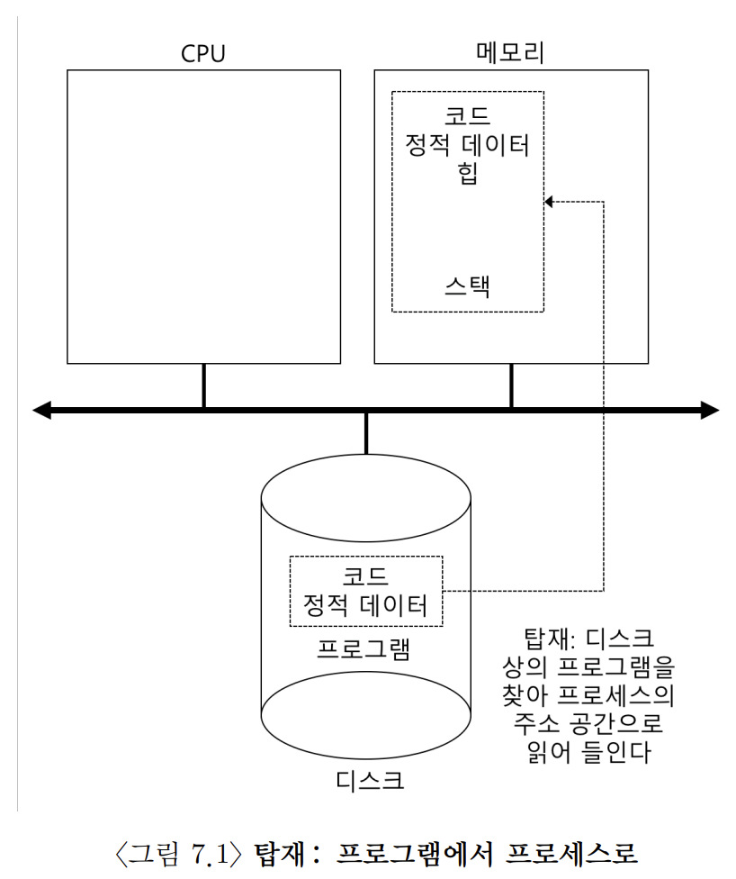
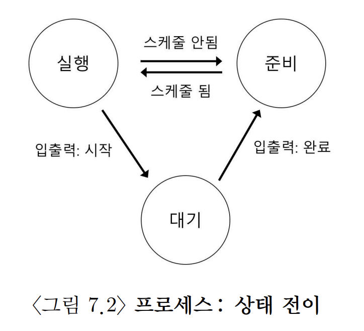
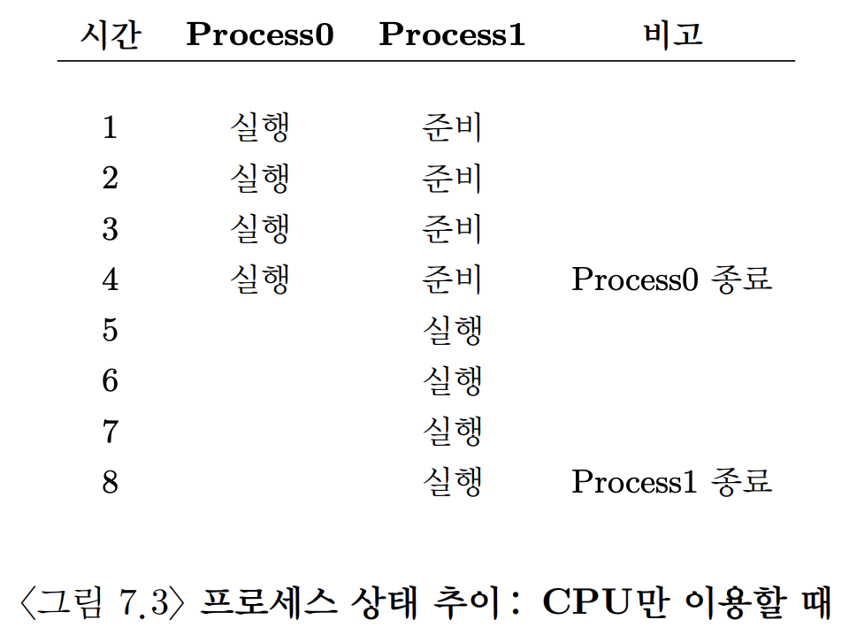
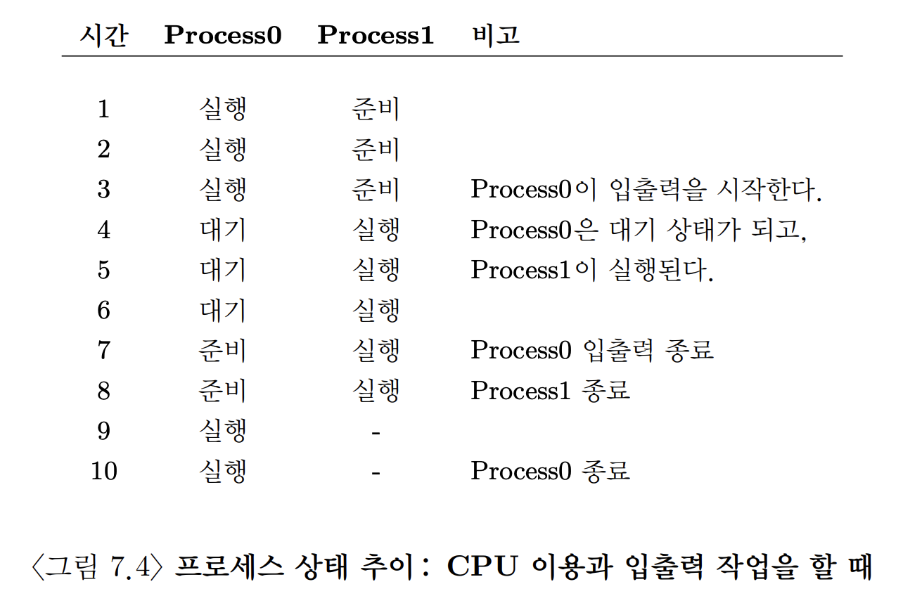
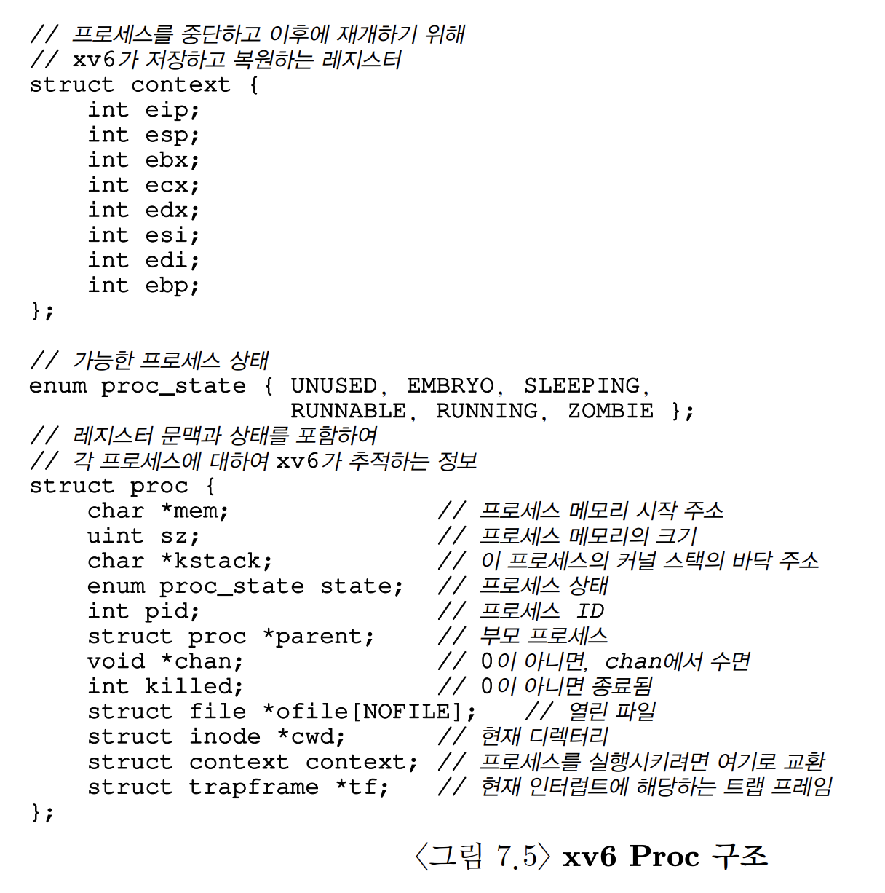

# [The Abstraction: The Process](https://pages.cs.wisc.edu/~remzi/OSTEP/Korean/04-cpu-intro.pdf)

## Index

- [0. 개요](#0-개요)
- [1. 프로세스의 개념](#1-프로세스의-개념)
- [2. 프로세스 API](#2-프로세스-api)
- [3. 프로세스 생성: 좀 더 자세하게](#3-프로세스-생성-좀-더-자세하게)
- [4. 프로세스 상태](#4-프로세스-상태)
- [5. 자료 구조](#5-자료-구조)

## 0. 개요

일반적으로 **프로세스(process)** 는 **실행 중인 프로그램** 으로 정의한다. 프로그램 자체는 디스크 상에 존재하는 명령어와 정적 데이터의 묶음이다. 이를 운영체제가 읽고 실행할 때, 비로서 프로그램에 생명이 생긴다.

사용자는 하나 이상의 프로그램을 동시에 실행시키기 원한다. 웹 브라우저, 메신저, 게임 등 말이다. 여러 프로그램을 동시에 실행할 수 있으면 사용자는 시스템을 더 쉽게 사용할 수 있다. 그리고 사용자가 사용 가능한 CPU가 있는지 신경쓰지 않고 그저 프로그램만 실행시킨다면 시스템을 아주 쉽게 사용할 수 있을 것이다.

> ### 핵심 질문: CPU가 여러 개 존재한다는 환상을 어떻게 제공하는가
> 적은 개수의 CPU 밖에 없더라도, 운영체제는 어떻게 거의 무한개에 가까운 CPU가 있는 환상을 만들 수 있는가?

운영체제는 CPU를 **가상화** 하여 위 문제를 해결한다. 하나의 프로세스를 실행하고, 얼마 후 중단시키고 다른 프로세스를 실행하는 작업을 반복하면서 실제 하나 또는 소수의 CPU로 여러 개의 가상 CPU가 존재하듯 만들어낸다. **시분할(time sharing)** 이라 불리는 이 기법은 원하는 수 만큼의 프로세스를 동시에 실행할 수 있게 한다. 시분할 기법은 CPU를 공유하기 때문에 각 프로세스의 성능은 낮아진다.

운영체제에서 CPU 가상화를 잘 구현하기 위해선, 저주순의 도구(매커니즘)와 고차원적인 지능(정책)이 필요하다.

- **매커니즘(mechanism)** : 필요한 기능을 구현하는 방법이나 규칙
  - **문맥 교환(context switch)** 의 구현과 같은 것
  - CPU에서 프로그램 실행을 잠시 중단하고 다른 프로그램을 실행하는 것이 문맥 교환이며 나중에 더 자세히 배운다.
- **정책(policy)** : 운영체제 내에서 어떤 결정을 내리기 위한 알고리즘
  - **스케줄링 정책(scheduling policy)** 등이 실행할 프로그램을 결정할 때, 정책을 기반으로 결정한다.
  - 직전 1분 동안 어떤 프로그램이 자주 실행되었는지, 어떤 유형의 프로그램들이 실행되었는지, 시스템이 어떤 목적으로 프로그램을 실행시키는지 등을 고려한다.

> ### 시분할과 공간 분할
> - 시분할(time sharing): 한 개체가 잠깐 자원을 사용한 후, 다른 개체가 또 잠깐 자원을 사용하고 그 다음 개체가 사용하며 많은 개체들이 자원을 공유하는 것
> - 공간분할(space sharing): 개체에 공간을 분할해 주는 것
> 	- 예를 들어 디스크는 자연스럽게 공간 분할을 할 수 있는 자원
> 	- 블럭이 하나의 파일에 해당되면 파일을 삭제하기 전에는 다른 파일이 할당될 가능성이 매우 낮다.

## 1. 프로세스의 개념

앞서 개요에서 봤듯, 운영체제는 **실행 중인 프로그램** 을 **프로세스(process)** 라 한다. 프로세스를 간단하게 표현하려면, 실행되는 동안 접근했거나 영향을 받은 자원의 목록을 작성하면 된다.

프로세스의 구성 요소를 이해하기 위해선 **하드웨어 상태(machine state)** 를 이해해야 한다. 프로그램이 실행되는 동안 하드웨어 상태를 읽거나 갱신할 수 있다. 이러한 하드웨어 상태를 구성하는 요소들은 다음과 같다.

- **메모리(주소 공간(address space))**
  - 하드웨서 상태 중 가장 중요한 구성 요소
  - 명령어, 실행 프로그램이 읽고 쓰는 데이터는 모두 메모리에 저장
  - 프로세스가 접근할 수 있는 메모리는 프로세스를 구성하는 요소
- **레지스터**
  - 많은 명령어들이 레지스터를 직접 읽거나 갱신
  - **프로그램 카운터(program counter, PC) 혹은 명령어 포인터(instruction pointer, IP)** : 프로그램의 어느 명령어가 실행 중인지 알려준다.
  - **스택 포인터(stack pointer)** 와 **프레임 포인터(frame pointer)** : 함수의 변수와 리턴 주소를 저장하는 스택을 관리할 때 사용하는 레지스터

프로그램은 영구 저장장치에 접근하기도 하며 이 입출력 정보는 프로세스가 현재 열어 놓은 파일 목록을 가지고 있다.

> ### 정책과 구현의 분리
> 운영체제의 공통된 설계 패러다임은 고수준 정책을 저수준 기법으로부터 분리하는 것
>
> - 저수준 기법
>   - "어떻게" 라는 질문에 답을 제공하는 것으로 생각할 수 있음
>   - 예시) 어떻게 문맥 교환을 구현하는가?
> - 고수준 정책
>   - "어느 것"이라는 질문에 답한다.
>   - 예시) 운영체제는 지금 당장 어느 프로세스를 실행시켜야 하는가?

## 2. 프로세스 API

실제 프로세스 API에 대한 논의는 다음 장으로 미루겠지만, 운영체제가 반드시 API로 제공해야 하는 몇몇 기본 기능에 대해 간단히 살펴본다. 이 API들은 형태는 다르지만 모든 현대 운영체제에서 제공된다.

- 생성(Create)
	- 운영체제는 새로운 프로세스를 생성할 수 있는 방법을 제공해야 함
	- 쉘에 명령어를 입력하거나 응용 프로그램의 아이콘을 더블 클릭하여 프로그램을 실행하면 운영체제는 새로운 프로세서 생성
- 제거(Destory)
	- 강제로 제거할 수 있는 인터페이스 역시 제공해야 함
	- 많은 프로세스는 할 일을 끝내면 스스로 종료
	- 스스로 종료하지 않는 프로세스가 있다면 그것을 중단시키는 API는 매우 유용
- 대기(Wait)
	- 때론 어떤 프로세스의 실행 중지를 기다릴 필요가 있기에 제공
- 각종 제어(Miscellaneous Control)
	- 프로세스의 제거, 대기 이외에 여러 가지 제어 기능들도 제공
	- 예를 들어, 대부분의 운영체제는 프로세스를 일시정지하거나 재개하는 기능을 제공
- 상태(State)
	- 프로세스 상태 정보를 얻어내는 인터페이스
	- 상태 정보엔 얼마 동안 실행되었는지, 프로세스가 어떤 상태에 있는지 등이 포함

## 3. 프로세스 생성: 좀 더 자세하게

그렇다면 프로그램은 어떻게 프로세스로 변형되는가? 

프로그램 실행을 위하여 운영체제가 하는 첫 번째 작업은 프로그램 코드와 정적 데이터(static data, 초기값을 가지는 변수 등)를 메모리, 즉 프로세스의 주소 공간에 **탑재(load)** 하는 것이다. 프로그램은 **디스크** 또는 요즘 시스템에서는 **플래시-기반 SSD** 에 특정 **실행 파일 형식** 으로 존재한다. 코드와 정적 데이터를 메모리에 탑재하기 위해서 운영체제는 디스크의 해당 바이트를 읽어서 메모리 어딘가에 저장해야 한다. (위 그림 참고)

> 초기 운영체제들과 달리 현대의 운영체제들은 프로그램을 실행하면서 코드나 데이터가 필요할 때, 필요한 부분만 메모리에 탑재한다. 코드와 데이터의 늦은 탑재 동작을 정확하게 이해하기 위해선 **페이징(paging)** 과 **스와핑(swapping)** 동작의 이해가 필요하며 이는 후에 배운다.

코드와 정적 데이터가 메모리에 탑재되었다면 프로세스를 실행시키기 전, 운영체제는 몇 가지 일을 해야 한다. 

- 일정량의 메모리가 프로그램의 **실행시간 스택(run-time stack, 혹은 stack)** 용도로 할당한다.
	- C 프로그램은 지역 변수, 함수 인자, 리턴 주소 등을 저장하기 위해 스택을 사용한다.
	- 운영체제는 스택의 메모리를 할당하고 이것을 프로세스에게 준다.
	- 그리고 운영체제는 인자들을 이용하여 초기화할 수도 있다.
	- 특별히, main() 함수 인자인 argc, argv를 사용하여 스택을 초기화한다.
- 프로그램의 **힙(heap)** 을 위한 메모리 영역을 할당한다.
	- C 프로그램에서 힙은 동적으로 할당된 데이터를  저장하기 위해 사용된다.
	- 프로그램은 malloc()을 호출하여 필요한 공간을 요청하고 free()를 호출하여 사용했던 공간을 반환하여 다른 프로그램이 사용하도록 한다.
	- 힙은 연결 리스트, 트리, 해시 테이블 등 크기가 가변적인 자료 구조를 위해 사용된다.
- 입출력과 관계된 초기화 작업을 수행한다.
	- 예를 들어 UNIX 시스템에서 STDIN, STDOUT, STDERR를 사용하여 프로그램이 터미널로부터 입력을 읽고 화면에 출력하는 작업을 쉽게 할 수 있다.

위와 같은 준비를 마치면 운영체제는 프로그램 실행을 위한 준비를 마치게 된다. 이제 남은 작엄은 프로그램의 시작 부분인 main()에서부터 프로그램을 실행하는 일만 남는다. main()의 routine(컴퓨터 프로그램의 일부로서, 특정한 일을 실행하기 위한 일련의 명령, 다음 장에서 자세히 공부할 예정)으로 넘어감으로써 운영체제는 CPU를 새로 생성된 프로세스에게 넘기고 프로그램이 실행된다.

## 4. 프로세스 상태

각 프로세스는 **상태(state)** 역시 가지고 있다. 프로세스의 상태에 관한 개념은 초기 컴퓨터 시스템에서 등장했는데 이를 단순화하면 세 가지 상태 중 하나를 가진다.

- 실행(Running): 프로세서에서 실행 중인 프로세스
- 준비(Ready): 프로세스를 실행할 수 있지만 운영체제가 다른 프로세스를 실행하는 등의 이유로 대기 중인 상태
- 대기(Blocked): 프로세스가 다른 사건을 기다리는 동안 프로세스의 수행을 중단시키는 연산
	- 예시) 프로세스가 디스크에 대한 입출력 요청을 하면 입출력이 완료될 때까지 Blocked되고 다른 프로세스가 실행상태로 바뀔 수 있다.

이는 아래와 같은 그림으로 나타낼 수 있다.

프로세스는 준비 상태와 실행 상태를 운영체제의 스케줄링 정책에 따라 이동하게 된다. 실행 상태에서 준비 상태가 되면 프로세스가 나중에 다시 스케줄 될 수 있음을 의미하고 대기 상태인 프로세스는 이벤트가 끝날 때까지 유지되다가 이벤트가 끝나면 준비 상태로 전이됨을 의미한다.

두 개의 프로세스가 입출력을 수행하지 않고 오직 CPU만 사용한다면 각 프로세스의 상태 전이는 다음과 같이 나타낼 수 있다.

만약 첫 번째 프로세스가 어느 정도 실행한 후에 입출력을 요청한다면 아래와 같이 첫 번째 프로세스는 대기 상태가 되고 두 번째 프로세스에게 실행 기회를 준다. 

위와 같이 간단한 상황에서도 운영체제가 내려야 할 결정이 많음에 주목해야 한다. 간단하게 생각해도 아래와 같다.

- Process 0이 입출력을 요청할 때 Process 1의 실행여부를 결정해야 한다.
- Process 0이 입출력을 완료했을 때, Process 0을 바로 실행할 것인가? 아니면 Process 1을 계속 실행할 것인가?

운영체제는 이러한 결정은 스케줄러를 통해 내린다. 이는 추후에 배운다.

> ### 자료 구조 - 프로세스 리스트
> 운영체제에는 다양한 자료 구조들이 많이 존재한다. 프로세스 리스트는 그 중 하나인데 자료 구조는 단순하다. 프로세스의 관리를 위한 정보를 저장하는 자료 구조를 **프로세스 제어 블럭(Process Control Block, PCB)** 라고 부른다.

## 5. 자료 구조

운영체제도 일종의 프로그램이기에 다른 프로그램들과 같이 다양한 정보를 유지하기 위한 자료 구조를 가지고 있다. 위에서 본 프로세스 리스트도 그 중 하나이다. 그 외에도 다양한 업무를 위해 많은 자료 구조가 필요하다.

아래의 그림은 xv6 커널에서 각 프로세스를 추적하기 위해 운영체제가 필요로 하는 정보를 보이고 있다. 다른 운영체제들도 이와 비슷한 프로세스 구조를 가지고 있다. 이는 생각보다 훨씬 복잡하다.

또한 위 그림을 통해서 운영체제가 관리할 수 있는 프로세스 정보들을 알 수 있다. **레지스터 문맥(register context)** 자료 구조는 프로세스가 중단되었을 때, 해당 프로세스의 레지스터값들을 저장한다. 그리고 다시 실행할 때, 이 레지스터값들을 복원하여 프로세스를 재개한다. **문맥 교환(context switch)** 라고 이름 붙여진 이 기법은 추후 자세히 다룬다.

프로세스의 상태를 보면 실행, 준비, 대기 외에도 다른 상태들이 존재함을 알 수 있다.

- **초기(initial)** 상태: 프로세스가 생성되는 동안에 머무는 상태
- **최종(final)** 상태: 프로세스는 종료되었지만 메모리에 남아있는 상태 (UNIX에선 **좀비(zombie)** 상태라고 부른다.)
	- 이 상태는 프로세스가 성공적으로 실행했는지를 다른 프로세스(보통은 부모 프로세스)가 검사하는데 유용하다.
	- 이를 위하여 최종 상태를 활용(UNIX에선 프로세스가 성공적으로 종료되었으면 0, 그렇지 않으면 0이 아닌 값을 반환한다.)

작업이 끝났을 때, 부모 프로세스는 자식 프로세스의 종료를 대기하는 시스템 콜을 호출(예를 들어 wait())한다. 이 호출은 종료된 프로세스와 관련된 자원들을 정리할 수 있다고 운영체제에 알리는 역할도 한다.