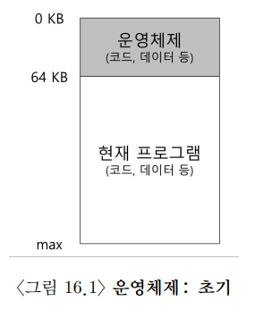
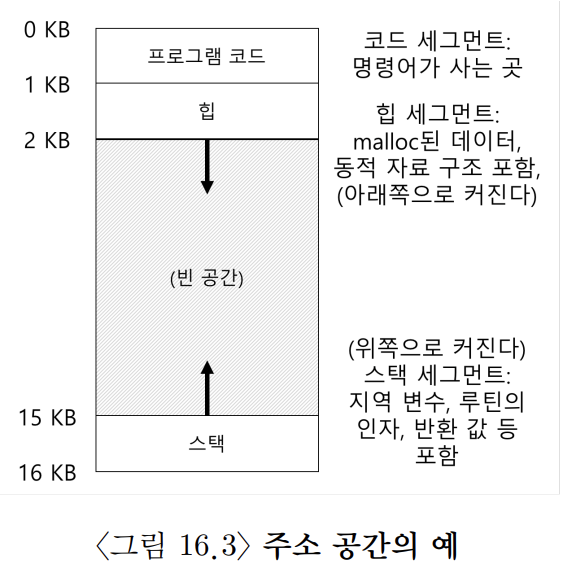
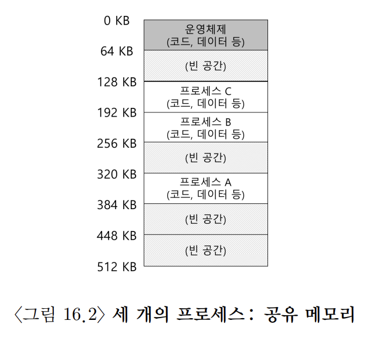

# [The Abstraction: Address Space](https://pages.cs.wisc.edu/~remzi/OSTEP/Korean/13-vm-intro.pdf)

## 1. 초기 시스템

메모리 관점에서 초기 컴퓨터는 많은 개념을 사용자에게 제공하지 않았다. 컴퓨터의 물리 메모리는 아래의 그림처럼 생겼었다.

- 운영체제는 메모리에 상주하는 루틴의 집합(실제로는 라이브러리의 집합)
- 물리 메모리에 하나의 실행 중인 프로그램이 존재하고 나머지 메모리를 사용
- 가상화는 존재하지 않았으며 사용자 역시 운영체제로부터 많은 것을 기대하진 않았다.

## 2. 멀티프로그래밍과 시분할

여러 프로세스가 실행 준비 상태에 있고 운영체제가 프로세스들을 전환하면서 실행하는 **멀티프로그래밍(multi-programming)** 시대가 도래했다. 하나의 프로세스가 입출력을 실행하면 CPU는 다른 프로세스로 전환하여 이용률을 증가시켰다. 당시엔 컴퓨터가 고가였기에 이런 효율성은 매우 중요했다.

그리고 일괄처리방식(batch computing) 컴퓨팅의 한계를 인식하고(특별히 오랜 시간이 걸리는 프로그램들) **시분할(time-sharing)** 과 **대화식 이용(interactivity)** 의 개념을 만들고 발전시켰다. 

초기 시분할은 하나의 프로세스를 짧은 시간 동안 실행시키는 것이다. 해당 기간 동안 프로세스는 모든 메모리에 접근할 권한이 주어진다. 이를 여러 프로세스로 전환하며 짧은 시간 동안 실행하고 저장되는 것에 반복이었다. 그러나 이 방법은 너무나 느렸다. 특히, 레지스터 상태를 저장하고 복원하는 것은 빠르지만 메모리 내용 전체를 디스크에 저장하는 것은 엄청나게 느렸다. 그렇기에 프로세스 전환 시, 프로세스를 메모리에 그대로 유지하며 시분할을 효율적으로 구현할 수 있게 해야 했다. 위 문제를 각 프로세스를 작은 부분에 할당하고 하나의 프로세스가 실행 중일 때, 다른 두 프로세스들은 준비 큐에서 실행을 기다리는 방식으로 해결하였다. 

이러한 시분할 시스템이 대중화되면서 운영체제는 여러 프로그램이 메모리에 동시에 존재하기 위해 **보호(protection)** 가 요구되었다.

## 3. 주소 공간

마음대로 메모리에 접근하지 못하게 하기 위하여 운영체제는 사용하기 쉬운 메모리 개념인 **주소 개념(address space)** 를 만들었다. 이는 실행 중인 프로그램이 가정하는 메모리의 모습이다. 이 개념이 메모리 가상화의 핵심 중 하나이다.

주소 공간은 실행 프로그램의 모든 메모리 상태를 갖고 있다. 예를 들어 다음과 같은 것들이 있을 수 있다.

- **코드(code, 명령어)** 
- **스택(stack)** : 함수 호출 체인 상의 현재 위치, 지역 변수, 함수 인자와 반환 값 등을 저장하는데 사용
- **힙(heap)** : 동적으로 할당되는 메모리를 위해 사용

이외에도 정적으로 초기화된 변수 등이 있지만 우선 위 세가지만 가정한다.

위 그림에서 메모리는 예를 위한 예시이다. 메모리가 아주 작은 공간인 16KB만 가지고 있다고 할 때 코드, 힙, 스택은 위 메모리에서 다음과 같이 배치되어야 한다.

- 코드
	- 주소 공간의 위쪽에 위치
	- 예시에선 0KB부터 1KB만큼 차지한다.
	- 코드는 정적이기에 메모리에 저장하기 쉽다.
	- 따라서 상단에 배치가 끝나면 추가 메모리가 실행되지 않는다.
- 힙
	- 주소 공간 상단에 위치
	- 메모리 영역을 확장할 수 있어야 한다.
	- 예시에선 1KB부터 시작하고 아래 방향으로 확장한다.
	- 예를 들어 사용자가 malloc() 을 실행했을 때
- 스택
	- 주소 공간 하단에 위치
	- 메모리 영역을 확장할 수 있어야 한다.
	- 예시에선 16KB부터 시작하고 위쪽으로 확장한다.
	- 예를 들어 사용자가 프로시저를 호출할 때

그러나 위와 같은 배치는 관례일 뿐, 원한다면 다른 방식으로 배치할 수 있다. 나중에 보겠지만 주소 공간에 여러 **쓰레드** 가 공존할 때는 이런 시긍로 주소 공간을 나누게 되면 동작하지 않는다.

주소 공간을 설명할 때, 운영체제가 실행 중인 프로그램에게 제공하는 **개념(abstraction)** 을 설명한다. 실제로 프로그램이 물리 주소 0에서 16KB 사이에 존재하는 것은 아니기 때문이다. 실제로는 임의의 물리 주소로 탑재된다.

> ### 핵심 질문
> 그렇다면 운영체제는 물리 메모리를 공유하는 다수의 프로세스에게 어떻게 프로세스 전용의 커다란 주소 공간이라는 개념을 제공하는가?

운영체제가 이와 같이 프로그램 자신이 특정 메모리에 탑재되고 매우 큰 주소 공간을 가지고 있다고 생각하게 만드는 것을 **메모리 가상화(virtualizing memory)** 라고 한다. 

예를 들어 위 그림처럼 실제 메모리에선 프로세스 A가 물리 주소(physical address) 320KB에 있지만 앞서 살펴본 그림에선 가상 주소(virtual address) 0에 있다. 그렇기에 운영체제는 하드웨워의 지원을 통해 가상 주소를 물리 주소로 변환해주어야 한다. 이것이 메모리 가상화의 핵심이다.

## 4. 목표

운영체제는 메모리를 가상화 할 뿐아니라 여러 멋진 기능들을 제공한다. 이를 위해서 가상화 메모리 시스템(VM)은 몇가지 목표를 가지고 있어야 한다.

- **투명성(transparency)**
	- 운영체제는 프로그램이 가상 메모리의 존재를 인지하지 못하도록 구현해야 한다.
	- 즉, 프로그램은 자신이 물리 메모리를 소유한 것처럼 행동해야 한다.
	- 그리고 많은 작업들이 메모리를 공유할 수 있도록, 운영체제와 하드웨어가 모든 작업을 수행해야 한다.
- **효율성(efficiency)**
	- 운영체제는 가상화가 시간과 공간 측면에서 효율적이도록 만들어야 한다.
	- 시간적으로는 프로그램이 너무 느리게 실행되서는 안 된다.
	- 공간적으로는 가상화를 지원하기 위한 구조를 위해 너무 많은 메모리를 사용해서는 안 된다.
	- 이때 운영체제는 TLB(나중에 배움) 등의 하드웨어 기능을 포함하여 많은 지원을 받아야 한다.
- **보호(protection)**
	- 운영체제는 프로세스를 다른 프로세스로부터 보호하고 자신도 프로세스로부터 보호해야 한다.
	- 프로세스는 어떤 방법으로든 다른 프로세스나 운영체제의 메모리에 접근하거나 영향을 줄 수 없어야 한다.
	- 보호를 통해 우리는 프로세스들을 서로 **고립(isolate)** 시킬 수 있다.

> ### 여담: 당신이 보는 모든 주소는 가상 주소이다.
> 포인터를 출력하는 C 프로그램에서 볼 수 있는 주소들도 **가상 주소** 이다. 물리 메모리 주소를 알 수 있는 것은 오직 운영체제뿐이다. 
>
>main의 주소(코드의 주소), malloc(1)한 곳의 주소(힙의 주소), 지역 변수가 저장된 주소(스택의 주소)를 출력하면 관례상 배치대로 코드가 위에 있고 다음엔 힙이 있으며 가운데 가상의 큰 빈 공간 후에 스택이 존재함을 확인할 수 있다.