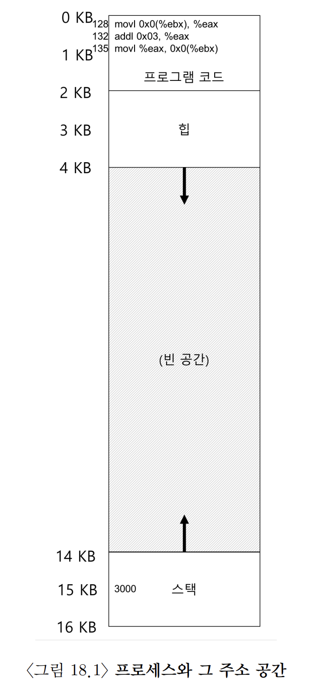
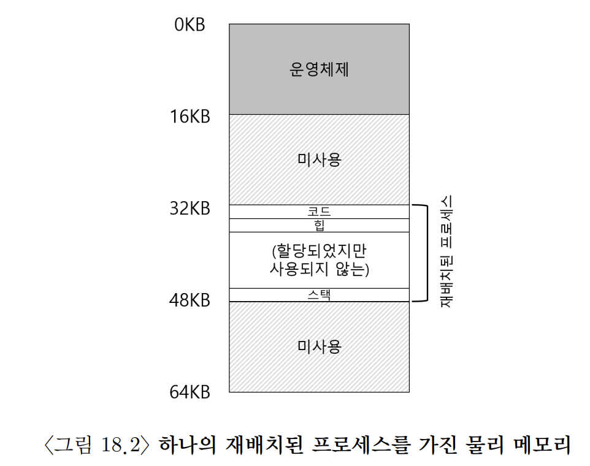
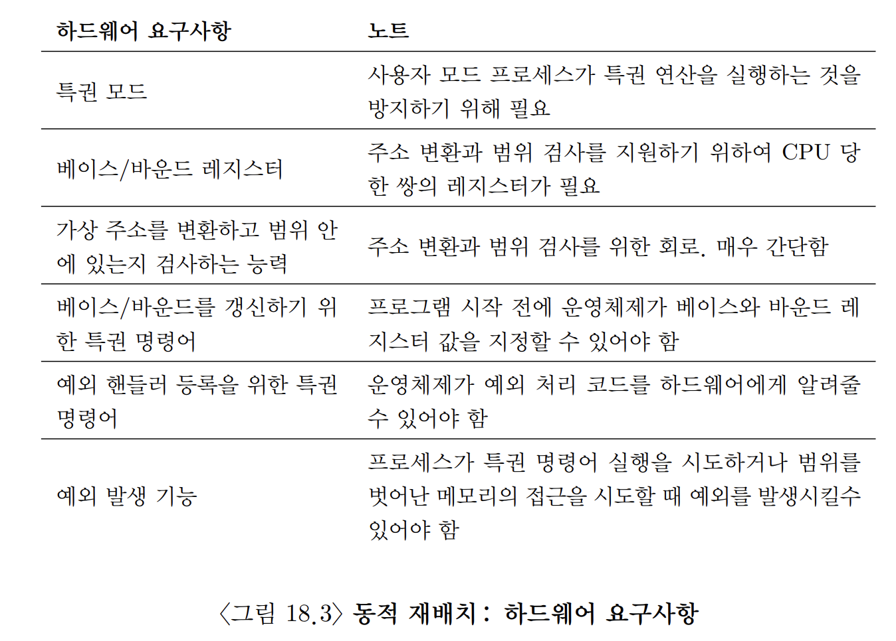
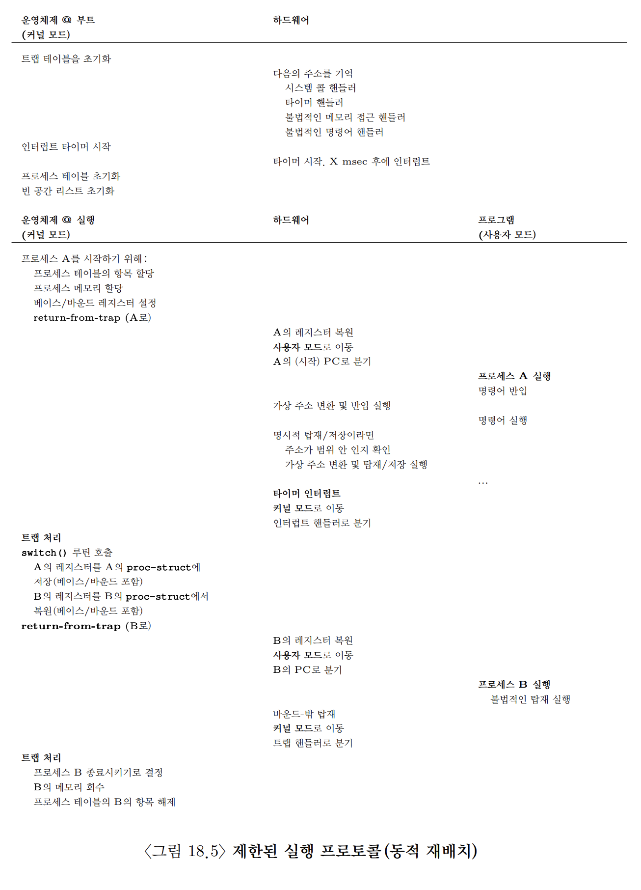

# [Mechanism: Address Translation](https://pages.cs.wisc.edu/~remzi/OSTEP/Korean/15-vm-mechanism.pdf)

## 0. 개요

효율성을 위해선 하드웨어 지원을 활용해야 한다. 또한 자기자신 외에 다른 메모리에 접근하지 못하도록 운영체제가 제어해야 한다. 마지막으로 유연성(flexibility) 측면에서 VM 시스템에서 필요한 사항이 있다. 프로그래머가 원하는 대로 주소 공간을 사용하고, 프로그래밍하기 쉬운 시스템을 만들기 원한다.

> ### 핵심질문: 어떻게 효율적이고 유연하게 메모리를 가상화하는가
> - 어떻게 효율적인 메모리 가상화를 구축할 수 있는가?
> - 프로그램이 필요로 하는 유연성을 어떻게 제공하는가?
> - 프로그램이 접근할 수 있는 메모리의 위치에 대한 제어를 어떻게 유지하는가?
> - 메모리 접근을 어떻게 적절히 제한할 수 있는가?
> - 어떻게 이 모든 것을 효율적으로 할 수 있는가?

이를 위해 우리가 사용할 기법은 **하드웨어-기반 주소 변환(hardware-based address translation)** 또는 그냥 **주소 변환(address translation)** 이다. 이 기술은 CPU 가상화에서 살펴봤던 제한적 직접 실행 방식에 부가적으로 사용되는 기능이라 할 수 있다. 주소 변환을 통해 여러 **가상 주소**들이 실제 **물리 주소**들로 변환된다. 프로그램의 모든 메모리 참조를 실제 메모리 위치로 재지정하기 위하여 하드웨어가 주소를 변환한다.

메모리 가상화 역시 CPU 가상화와 목표가 비슷하다. CPU가 한 프로그램에서 다른 프로그램으로 전환하며 사용자들에게 동시에 작업된다는 환상을 주듯이, 운영체제는 프로그램마다 여유있는 메모리를 가지고 있다는 환상을 사용자에게 주어야 한다.

## 1. 가정

- 당분간 사용자 주소 공간은 물리 메모리에 연속적으로 배치되어야 한다.
- 주소 공간의 크기가 너무 크지 않다.
- 주소 공간은 물리 메모리 크기보다 작다.
- 각 주소 공간의 크기는 같다.

위의 가정들을 점차 완화하며 실제적인 메모리의 가상화를 이끌어 낼 것이다.

## 2. 사례

```c
void func()
{
	int x = 3000;
	x = x + 3;
}
```

위 코드를 어셈블리 코드로 변환하고 그 결과는 다음과 같다.

```assembly
128: movl 0x0(\%ebx) , \%eax ; 0+ebx를 eax에 저장
132: addl \$0x03, \%eax ; eax레지스터에 3을 더한다
޵݅⦽ 135: movl \%eax, 0x0(\%ebx) ; eax를 메모리에 다시 저장
```

위 코드는 아래와 같이 동작한다.

0. x의 주소는 레지스터 ebx에 저장되어 있다고 가정
1. ebx에 저장되어 있는 값을 movl 명령어(longword를 이동하는 명령어)를 사용하여 범용 레지스터 eax에 넣는다.
2. 그 후, eax에 3을 더하고, 마지막 명령은 eax의 값을 같은 위치의 메모리에 저장한다.

세 개의 명령어의 코드는 주소 128(상단 코드 섹션)에 위치하고, 변수 x의 값은 주소 15KB(스택 영역)에 위치한다. 아래 그림과 같다.



위 명령어가 실행되면 프로세스 관점에선 다음과 같은 메모리 접근이 일어난다.

1. 주소 128의 명령어를 반입
2. 이 명령어 실행 (주소 15KB에서 탑재)
3. 주소 132의 명령어를 반입
4. 이 명령어 실행 (메모리 참조 없음)
5. 주소 135의 명령어 반입
6. 이 명령어 실행 (15KB에 저장)

프로그램 관점에서 **주소 공간** 은 주소 0부터 시작하여 최대 16KB까지이다. 그렇기에 프로그램이 생성하는 모든 메모리 참조는 이 범위 내에 있어야 한다. 또한 운영체제는 메모리 가상화를 위해 프로세스를 물리 메모리 주소 0이 아닌 다른 곳에 위치시키고 싶다. 그렇다면 어떻게 프로세스 모르게 메모리를 다른 위치에 **재배치** 하느냐가 해결할 문제이다.

이 프로세스의 주소 공간이 메모리에 배치되었을 때, 가능한 물리 메모리 배치의 하나의 예시는 다음 그림과 같다. 



첫 칸은 운영체제가 사용하는 것을 볼 수 있고 위 예의 프로세스는 물리 주소 32KB에서 시작하는 슬롯에 재배치된 것을 볼 수 있다. 다른 두 슬롯 (16KB ~ 32KB와 48KB ~ 64KB) 은 비어 있다.

## 3. 동적 (하드웨어-기반) 재배치

1950년대 후반의 첫 번째 시분할 컴퓨터에서 **베이스와 바운드(base and bound)** 라는 간단한 아이디어가 나왔다. 이 기술은 **동적 재배치(dynamic relocation)** 라고도 한다.

각 CPU마다 2개의 하드웨어 레지스터가 필요하다. 하나는 **base** 레지스터라고 하고, 다른 하나는 **bound** 레지스터 혹은 **한계(limit)** 레지스터라고 불린다. 한 쌍의 레지스터는 우리가 원하는 위치에 주소 공간을 배치할 수 있게 한다. 그리고 배치와 동시에 프로세스가 오직 자신의 주소 공간에만 접근한다는 것을 보장한다. 

이 설정에서 각 프로그램은 주소 0에 탑재되는 것처럼 작성되고 컴파일된다. 프로그램 시작 시, 운영체제가 프로그램이 탑재될 물리 메모리 위치를 결정하고 베이스 레지스터를 그 주소로 지정한다. 위의 예에선 운영체제는 프로세스를 물리 주소 32KB에 저장하기로 결정하고 베이스 레지스터를 이 값으로 설정한다. 그리고 이를 통해 프로세스에 의해 생성되는 모든 주소가 다음과 같은 방법으로 프로세서에 의해 변환된다.

$$
physical\;\;address\;=\;virtual\;\;address\;+\;base
$$
프로세스가 생성하는 메모리 참조는 **가상 주소** 이다. 하드웨어는 베이스 레지스터의 내용을 이 주소에 더하여 **물리 주소** 를 생성한다. 

앞서 봤던 코드 중 하나를 살펴보자.

```assembly
128: movl 0x0 (%EBX) , % eax
```

1. 프로그램 카운터는 128로 설정된다. 
2. 하드웨어가 이 명령어를 반입할 때, 먼저 PC값을 베이스 레지스터의 값인 32KB(32768byte)에 더해 32896byte의 물리 주소를 얻는다. 
3. 하드웨어는 해당 물리 주소에서 명령어를 가져온다.
4. 프로세서는 명령어를 실행한다.
5. 얼마 후, 프로세스는 가상 주소 15KB의 값을 탑재하라는 명령어를 내린다.
6. 이 주소를 프로세서가 받아서 다시 베이스 레지스터(32KB)를 더하고 물리 주소 47KB에 원하는 내용을 탑재한다.

이 동작이 바로 **주소 변환** 이다. 이 주소 재배치는 실행 시에 일어나고, 프로세스가 실행을 시작한 이후에도 주소 공간을 할 수 있기 때문에, **동적 재배치(dynamic relocation)** 라고도 불린다.

베이스 레지스터와 다르게 바운드(한계) 레지스터는 보호를 지원하기 위해 존재한다. 프로세서는 먼저 메모리 참조가 합법적인가를 확인하기 위해 가상 주소가 바운드 안에 있는지 확인한다. 앞에서 다룬 간단한 예에서, 바운드 레지스터는 항상 16KB로 설정된다. 프로세스가 바운드보다 큰 가상 주소나 음수인 가상 주소를 참조하면 CPU는 예외를 발생시키고 프로세스는 종료될 것이다. 바운드의 요점은 프로세스가 생성한 모든 주소가 **합법적** 이고 프로세스의 **범위** 에 있다는 것을 확인하는 것이다.

베이스와 바운드 레지스터는 CPU당 1쌍이 존재하는 하드웨어 구조이다. 그렇기에 주소 변환에 도움을 주는 프로세서의 일부를 **메모리 관리 장치(memory management unit, MMU)** 라고 부르기도 한다. 바운드 레지스터는 두 가지 중 하나의 방법으로 정의될 수 있다.

1. 주소 공간의 크기를 저장하는 방식
		- 가상 주소를 베이스 레지스터에 더하기 전에 먼저 바운드 레지스터와 비교
2. 주소 공간의 마지막 물리 주소를 저장하는 방식
		- 가상 주소에 베이스 레지스터를 더하고 그 결과가 바운드 레지스터 안에 있는지 비교

우리는 논의를 간단하게 하기 위해 첫번째 방법을 사용한다.

## 4. 하드웨어 지원: 요약



- **프로세서 상태 워드(processor status word)** 레지스터의 한 비트가 CPU의 현재 실행 모드를 나타냄
- 예외가 발생했을 때, 운영체제의 **예외 핸들러(exception handler)** 가 실행되도록 조치해야 한다.

## 5. 운영체제 이슈

베이스와 바운드 방식의 가상 메모리 구현을 위해서 운영체제가 반드시 개입되어야 하는 세 가지의 중요한 시점이 존재한다.

1. 프로세스가 생성될 때, 운영체제는 주소 공간이 저장될 메모리 공간을 찾아 조치를 취해야 한다.
		- 다행히 주소 공간은 아래의 가정하에선 운영체제가 쉽게 처리할 수 있다.
			- 물리 메모리의 크기보다 작다.
			- 크기가 일정하다.
		- 새로운 프로세스가 생성되면 운영체제는 새로운 주소 공간 할당에 필요한 영역을 찾기 위해 (흔히 **빈 공간 리스트(free list)** 라고 불리는) 자료 구조를 검색해야 한다.
2. 프로세스가 (정상 종료든, 강제 종료든) 종료할 때, 프로세스가 사용하던 메모리를 회수하여 다른 프로세스나 운영체제가 사용할 수 있게 해야 한다.
		- 프로세스가 종료하면, 운영체제는 종료한 프로세스의 메모리를 다시 빈 공간 리스트에 넣고 연관된 자료 구조를 모두 정리한다.
3. 운영체제는 문맥 교환이 일어날 때에도 몇 가지 추가 조치를 취해야 한다.
		- 베이스-바운드 레지스터는 한 쌍만 존재하기에 각 프로그램마다 다른 값을 가진다.
		- 그렇기에 운영체제는 프로세스를 중단시키려면 메모리에 존재하는 **PCB(process control block, 프로세스 제어 블럭)** 안에 이 값들을 저장해야 한다.
		- 마찬가지로 운영체제는 프로세스를 처음 실행하거나 다시 시작할 때, 이 프로세스에 맞는 값으로 CPU의 베이스-바운드 레지스터 값을 설정해야 한다.
4. 운영체제는 예외 핸들러나 호출될 함수를 제공해야 한다.
		- 운영체제는 부팅할 때, 특권 명령어를 사용하여 이 핸들러를 설치한다.
		- 불법 행위를 한 프로세스를 종료시킨다.


