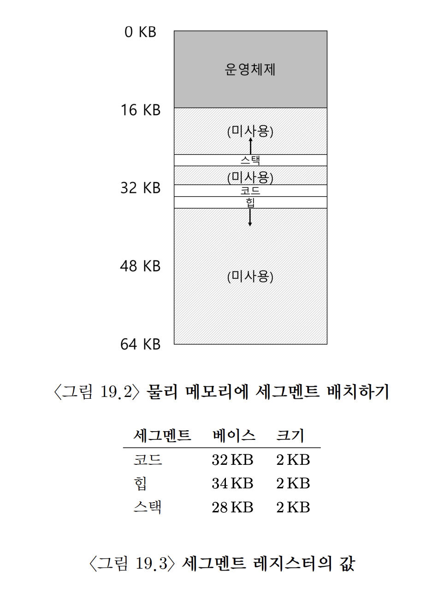
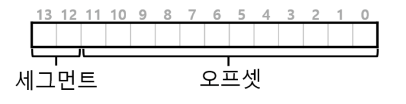
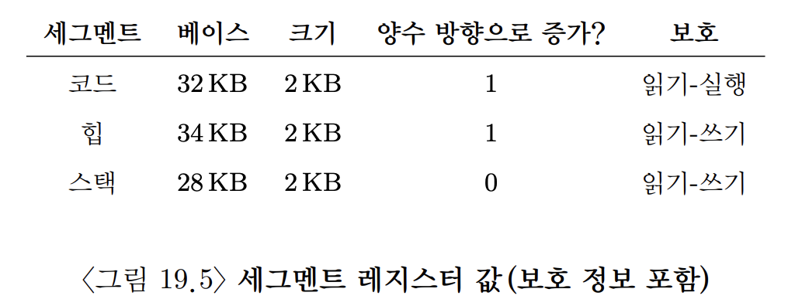
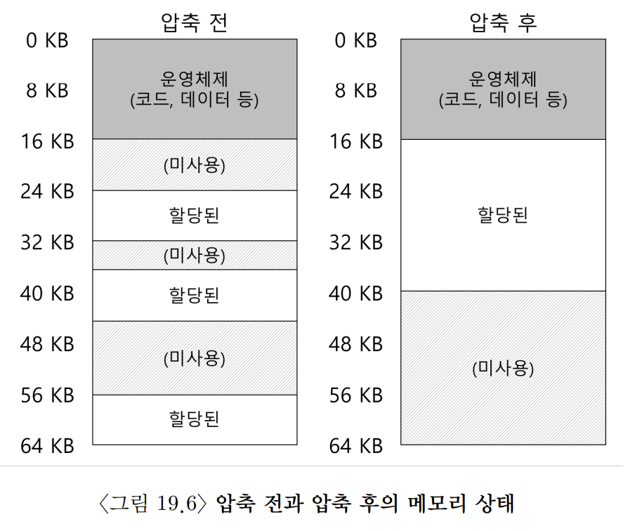

# [Segmentation](https://pages.cs.wisc.edu/~remzi/OSTEP/Korean/16-vm-segmentation.pdf)

## 0. 개요

스택과 힙 사이의 공간은 사용되지 않더라도 주소 공간을 물리 메모리에 재배치할 때, 물리 메모리를 차지한다. 그렇기에 베이스와 바운드 레지스터 방식은 메모리 낭비가 심하다. 또한, 주소 공간이 물리 메모리보다 큰 경우 실행이 매우 어렵다. 이런 측면에선 베이스와 바운드 방식은 유연성이 없다.

## 1. 세그멘테이션: 베이스/바운드의 일반화

위의 문제를 해결하기 위해 나온 아이디어가 바로 **세그멘테이션(segmentation)** 이다. 아이디어는 간단한데 MMU 안에 오직 하나의 베이스-바운드 쌍이 존재하는 것이 아니라 주소 공간의 논리적인 **세그멘트(segment)** 마다 베이스-바운드 쌍이 존재한다. (이때 세그먼트는 특정 길이를 가지는 연속적인 주소 공간이다. 우리가 기준으로 삼은 주소 공간에는 코드, 스택, 힙 세 종류의 세그멘트가 있다.)  세그멘테이션을 사용하면 운영체제는 각 세그멘트를 물리 메모리의 각기 다른 위치에 배치할 수 있고 사용되지 않는 가상 주소 공간이 물리 메모리를 차지하는 것을 방지할 수 있다.

위 그림처럼 각각에 세그멘트가 지정된다.

즉, 가상 메모리는 베이스를 기준으로 몇 번째 위치에 있는지를 나타내는 주소가 되는 것이다. 그리고 이러한 세그멘트 범위를 벗어나면 **세그멘트 위반(segment violation)** 또는 **세그멘트 폴트(segment fault)** 에러를 발생시키며 프로세스를 종료시킨다.

> ### 세그멘트 폴트
> 이 용어는 세그멘트에 대한 지원이 전혀 없는 컴퓨터에서도 여전히 사용된다. 이 경우, 코드의 오류를 찾을 수 없다.

## 2. 세그멘트 종류의 파악

그렇다면 하드웨어는 가상 주소가 어느 세그멘트를 참조하고 오프셋이 얼마인지 어떻게 알 수 있는가?

한 가지 방법은 가상 주소의 최상위 몇 비트를 기준으로 주소 공간을 여러 세그멘트로 나누고 오프셋을 베이스로부터 몇번째 위치인지 적는 방법이다. 

이 방식은 오프셋이 바운드보다 작은지 여부만 검사하면 되기에 바운드 검사도 간단하다. 

물론 이 방식은 세그멘트가 예를 들어 00, 01, 11 세 가지만 만들어지기에 (코드, 스택, 힙만 만드므로) 10으로 시작하는 메모리 주소를 낭비하는 결과를 가져온다. 이 문제를 해결하기 위해 일부 시스템은 코드와 힙을 하나의 세그멘트에 저장하고 세그멘트 선택을 위해 1비트만 사용한다.

다른 방법으로 **묵시적(implicit)** 접근 방식이 있는데, 이는 주소가 어떻게 형성되었나를 관찰하여 세그멘트를 결정한다. 예를 들어, 주소가 프로그램 카운테에서 생성되었다면 코드 세그멘트에, 스택 또는 베이스 포인터에 기반을 두었다면 스택 세그멘트에, 이 외는 모두 힙 세그멘트에 존재함을 알 수 있다.

## 3. 스택

스택은 다른 세그멘트들과는 반대 방향으로 확장된다는 특징이 있다. 이는 다른 방식을 필요로 한다.

첫 번째, 간단한 하드웨어가 추가로 필요하다. 베이스와 바운드 뿐만 아니라 하드웨어는 세그멘트가 어느 방향으로 확장하는지도 알아야 한다. 예를 들어 하나의 비트를 사용하여 주소가 커지는 쪽으로 확장하면 1, 작아지면 0으로 설정할 수 있다.

거꾸로 쌓이는 세그멘트에서 주소 변환하는 과정의 예시를 보면 다음과 같다. 

가상 주소 15KB에 접근한다고 가정하면 물리 주소 27KB에 매핑되어야 한다. 이 가상 주소를 이진 형태로 바꾸면 11 1100 0000 0000 (16진수 0x3C00) 이 된다. 하드웨어는 상위 2비트 (11)를 사용하여 세그멘트를 지정한다. 이를 고려하면 오프셋은 3KB(1100 0000 0000 byte)이다. 

올바른 음수 오프셋을 얻기 위해선 세그멘트의 최대 크기를 빼줘야 한다. 이 예시에선 세그멘트의 최대 크기가 4KB(1111 1111 1111 1111 byte)이고 따라서 올바른 오프셋은 3KB - 4KB = -1KB이다. 이 음수 오프셋을 베이스(28KB)에 더하면 올바른 물리 주소인 27KB를 얻을 수 있다. 또한 바운드 검사는 음수 오프셋의 절댓값이 세그멘트의 크기보다 작다는 것을 확인하여 계산할 수 있다.

## 4. 공유 지원

세그멘테이션 기법이 발전함에 따라 간단한 하드웨어 지원으로 새로운 종류의 효율성을 성취할 수 있게 되었다. 그 방법은 메모리를 절약하기 위해 때로는 주소 공간들 간에 특정 메모리 세그멘트를 공유하는 것이다. 특히, **코드 공유**가 일반적이며, 현재 시스템에서도 광범위하게 사용 중이다. 

우선 공유를 지원하기 위해, 하드웨어에 **protection bit** 의 추가가 필요하다. 세그멘트마다 protection bit를 추가하여 읽거나 쓸 수 있는지, 코드를 실행시킬 수 있는지를 나타낸다. 코드 세그멘트를 읽기 전용으로 설정하면 주소 공간의 독립성을 유지하면서도, 여러 프로세스가 주소 공간의 일부를 공유할 수 있다. 각 프로세스는 여전히 자신의 전용 메모리를 사용하고 있다고 생각하지만 운영체제는 이 변경이 불가능하도록 설정된 메모리 영역을 비밀리에 공유시켜 환상을 유지하는 것이다.

protection bit를 사용하면 앞서 언급된 하드웨어 알고리즘은 가상 주소가 범위 내에 있는지 확인하는 것 이외에 특정 액세스가 허용되는지를 확인해야 한다. 또한 보호를 침해하려 한다면 예외를 발생시켜 운영체제가 위반 프로세스를 처리할 수 있도록 해야 한다.

## 5. 소단위 vs 대단위 세그멘테이션

우리가 지금까지 봐왔던 세그멘테이션(코드, 스택, 힙)을 **대단위(coarse-grained)**  라고 생각할 수 있다. 주소 공간을 비교적 큰 단위의 공간으로 분할하기 때문이다. 이와 반대로 일부 초기 시스템은 주소 공간을 작은 크기의 공간으로 잘게 나누는 것이 허용되었기 때문에 **소단위(fine-grained)** 세그멘테이션이라고 부른다.

그렇기에 많은 수의 세그멘트를 지원하기 위해서는 여러 세그멘트의 정보를 저장할 수 있는 **세그멘트 테이블** 을 이용하여 세그멘트들을 사용한다. 

## 6. 운영체제의 지원

위와 같은 방식은 스택과 힙 사이의 사용하지 않는 공간에 물리 메모리를 할당할 필요가 없기 때문에 같은 크기의 물리 메모리에 더 많은 주소 공간을 탑재할 수 있다.

그러나 세그멘테이션은 많은 새로운 문제들을 야기한다. 

1. 문맥 교환 시, 운영체제는 세그멘트 레지스터의 저장과 복원을 해야 한다.
2. 미사용 중인 물리 메모리 공간을 잘 관리해야 한다. 
		- 일반적으로 생길 수 있는 문제는 물리 메모리가 빠르게 작은 크기의 빈 공간들로 채워진다는 것
		- 작은 빈 공간들은 새로이 생겨나는 세그멘트에 할당하기도 힘들고 기존 세그멘트를 확장하는 데도 도움이 되지 않는다. -> 이를 **외부 단편화(external fragmentation)** 이라고 한다.

위 예시에선 새로운 프로세스가 생성되어 20KB를 할당하려고 한다. 빈 공간 전체는 24KB의 빈 공간이 존재하긴 하지만 하나의 연속된 공간이 아니기에 요청을 충족할 수 없다. 그렇기에 기존의 세그멘트를 정리하여 물리 메모리를 **압축(compact)** 하는 것이다. 

예를 들어 다음과 같은 과정을 거치는 것이다.

1. 운영체제는 현재 실행 중인 프로세스를 중단
2. 프로세스의 데이터를 하나의 연속된 공간에 복사
3. 세그멘트 레지스터가 새로운 물리 메모리 위치를 가리킴
4. 공간 확보

하지만 세그멘트 복사는 메모리에 부하가 큰 연산이고 일반적으로 상당량의 프로세서 시간을 사용하기 때문에 압축 비용이 높다. 

이에 비해 간단한 방법은 빈 공간 리스트를 관리하는 알고리즘을 사용하는 것이다. 빈 공간 관리 알고리즘은 할당 가능한 메모리 영역들을 리스트 형태로 유지한다. **최적 적합(best-fit)** , **최악 적합(worst-fit)** , **최초 적합(first-fit)** 및 **버디 알고리즘(buddy algorithm)** 과 같은 고전적인 알고리즘을 포함하여 말 그대로 수백 개의 방식이 존재한다. 이 중에서 최적 적합은 빈 공간 리스트에서 요청된 크기와 가장 비슷한 크기의 공간을 할당한다. 

좋은 알고리즘이라도 외부 단편화는 여전히 존재한다. 그렇기에 좋은 알고리즘은 외부 단편화를 가능한 줄이는 것이 목표다.

## 7. 요약

세그멘테이션의 장단점

- 장점
	- 메모리 가상화를 효과적으로 실현
	- 단순한 동적 재배치를 넘어 논리 세그먼트 사이의 큰 공간에 대한 낭비를 피할 수 있다.
	- 즉, 드문드문 사용되는 주소 공간(sparse address space)을 지원
	- 필요한 산술 연산은 쉽고 하드웨어 구현에 적합하기에 속도도 빠르다.
	- 변환 오버헤드도 최소이다.
	- 코드 공유의 장점도 부가적으로 발생한다.
	- 코드가 별도의 세그멘트에 존재한다면 그러한 코드는 실행 중인 여러 프로그램 사이에서 공유될 수 있다.
- 단점
	- 그러나 세그멘트의 크기가 일정하지 않기 때문에 몇 가지 문제가 생긴다.
	- 외부 단편화 관련한 문제가 생긴다.
	- 가변 크기가 다 다르기에 메모리 할당 요청을 충족시키는 것이 어렵다.
	- 세그멘테이션도 아직 일반적으로 드문드문 사용되는 주소 공간을 지원할만큼 충분히 유연하지 못하다는 것이다. 
	- 주소 공간이 사용되는 모델과 이를 지원하기 위한 세그멘테이션의 설계 방법이 정확하게 일치하지 않으면 세그멘테이션은 제대로 동작하지 않는다.