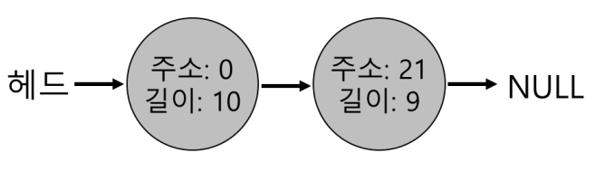

# Free-Space Management

이번 챕터는 메모리 가상화 논의에서 약간 우회하여 모든 메모리 관리 시스템의 근본적인 측면을 논의한다. 구체적으로 **빈 공간 관리**에 관련된 문제를 논의한다. 

문제를 구체화해보자. **페이징** 개념을 논의할 때 보겠지만 빈 공간 관리는 쉬울 수 있다. 관리하고 있는 공간이 고정 크기의 단위로 나누어져 있는 경우, 특히 쉽다. 그런 경우 그냥 이 고정 크기 단위의 리스트를 유지하면 된다. 

그러나 관리하는 공간이 가변적이며 빈 공간들의 집합으로 구성되어 있는 경우는 어려워진다. 이 경우는 결국 사용자의 입장이든(malloc(), free() 등), 세그멘테이션으로 물리 메모리를 관리하는 운영체제에서 발생하든 외부 단편화가 존재한다. 그렇기에 빈 공간의 전체 크기가 요청된 것보다 크더라도 하나의 연속된 영역이 존재하지 않으면 요청은 실패할 수 있다.

그렇다면 빈 공간은 어떻게 관리해야 하는가?

## 1. 가정

힙의 빈 공간은 일반적인 링크드리스트가 사용된다. 이 자료 구조는 영역 내의 모든 빈 청크에 대한 주소를 갖는다. 

우리는 **외부 단편화** 를 중점적으로 볼 테지만 **내부 단편화** 가 일어날 수도 있다. 할당기가 요청한 크기보다 더 큰 메모리 청크를 할당할 경우, 요청되지 않거나 사용되지 않는 공간에 대해서는 할당 청크의 내부에서 낭비가 일어날 수 있고 이를 내부 단편화라고 한다.

또한 클라이언트에게 할당된 메모리는 다른 위치로 재배치될 수 없다고 가정한다. 예를 들어, 프로그램이 malloc() 을 호출하여 힙의 일부 영역에 대한 포인터를 받으면, 그 메모리 영역은 대응하는 free() 를 통하여 반환될 때까지 프로그램이 소유하게 되고 라이브러리에 의해 다른 위치로 옮겨질 수 없다. 이때, 단편화 해결에 유용하게 사용되는 빈 공간의 **압축**은 경우에는 사용이 불가능하다.

## 2. 저수준 기법들

세부 정책에 대해서 설명하기 전에 먼저 대부분의 할당기에서 사용되는 일반적인 기법에 대해 논의한다.

1. **분할(splitting)** 과 **병합(coalescing)** 의 기초
2. 할당된 영역의 크기를 빠르고 상대적으로 쉽게 파악할 수 있는 방법

### 분할과 병합

빈 공간 리스트는 힙에 있는 빈 공간들의 집합이다. 30바이트의 힙이 있다고 가정하자.

이 힙의 빈 공간 리스트에는 2개의 원소가 있다. 하나는 첫 번째 10바이트의 빈 세그멘트를 설명하고 다른 하나는 나머지 빈 세그멘트를 표현한다.

앞에서 언급한 바와 같이, 10바이트를 초과하는 모든 요청은 실패하여 NULL을 반환할 것이다. 요청한 크기에 해당하는 메모리 청크가 없기 때문이다. 10바이트에 대한 요청은 둘 중 하나의 빈 청크를 사용하여 쉽게 충족된다. 그렇다면 10바이트보다 작은 요청에 대해서는 어떤 일이 일어나는가?

메모리를 1바이트만 요청했다고 가정했을 때, **분할(splitting)** 로 알려진 작업을 수행한다. 

1. 요청을 만족시킬 수 있는 빈 청크를 찾아 둘로 분할
2. 첫 번째 청크는 호출자에게 반환, 두 번째 청크는 리스트에 남게 된다.
3. 위 그림에서 두 번째 청크에게 할당하기로 결정되었다면 malloc()은 20(1바이트가 할당된 영역의 주소)을 반환하고 최종 빈 리스트는 다음과 같이 된다.

기본적인 리스트의 모습은 바뀌지 않으며 빈공간이 20이 아니라 21에서 시작하고 길이가 9가 된 것만 확인할 수 있다. 이렇게 요청이 특정 빈 청크의 크기보다 작은 경우 분할 기법을 사용한다.

이런 분할에 당연히 동반되는 작업은 **병합(coalescing)** 이다. 

만약 빈 공간 10바이트, 사용 중 10바이트, 또 하나의 빈 공간 10바이트인 상황(위에 위에 그림)에서 응용프로그램이 free(10)을 호출하여 힙의 중간에 존재하는 공간을 반한할 때 어떤 일이 일어나는가? 깊게 생각하지 않는다면 다음과 같은 결과를 초래한다. 

10바이트의 청크, 3개로 구성되어있기에 20바이트 같은 요청이 들어오면 반환하지 못하고 실패를 반환한다. 이를 방지하기 위해 할당기가 할 수 있는 것은 메모리 청크를 병합하는 것이다. 메모리 청크를 반환할 때, 해제되는 청크의 주소와 바로 인접한 빈 청크의 주소를 살펴봐서 인접해있다면 새로 해제된 빈 공간과 병합하는 것이다. 이 과정을 거치면 병합 이후의 최종 리스트는 다음과 같은 모양이 된다.

### 할당된 공간의 크기 파악

free()는 크기를 매개변수로 받지 않는다는 것을 알고 있을 것이다. 포인터가 인자로 전달되면 라이브러리는 해제되는 메모리 영역의 크기를 신속히 파악하여 그 공간을 빈 공간 리스트에 추가시킬 수 있다고 가정한다.

이 작업을 위해 대부분의 할당기는 추가 정보를 **헤더(header)** 블럭에 저장한다. 헤더 블럭은 메모리에 유지되며 보통 해제된 청크 바로 직전에 위치한다. 

위 그림에선 ptr이 가리키는 크기 20바이트의 할당된 블럭을 검토하고 있다. 사용자는 malloc()을 호출하고 그 결과를 ptr에 저장했다고 가정하자. 

헤더는 적어도 할당된 공간의 크기, 해제 속도를 향상시키기 위한 추가 포인터, 부가적인 무결성 검사를 제공하기 위한 매직 넘버, 기타 정보들을 저장할 수 있다. 그림 20.2는 사용자가 free(ptr)을 호출했을 때, 헤더의 시작 위치를 파악하기 위해 간단한 포인터 연산을 한다. 

헤더를 가리키는 포인터를 얻어 내면, 라이브러리는 매직 넘버가 기대하는 값과 일치하는지 비교하여 **안전성 검사(sanity check)** 를 실시한다. (assert (hptr->magic == 1234567)). 그리고 새로 해제된 영역의 크기를 간단한 수학을 통해 계산한다. 

이때 주의할 점은 빈 영역의 크기는 "헤더 크기 + 사용자에게 할당된 영역의 크기" 이다. 사용자가 N 바이트의 메모리 청크를 요청하면 라이브러리는 크기 N의 빈 청크를 찾는 것이 아니라 빈 청크의 크기 N + 헤더 크기인 청크를 탐색한다.

### 빈 공간 리스트 내장

그렇다면 이러한 리스트를 빈 공간에 어떻게 구현할 수 있는가? malloc()을 호출하는 것은 불행히도 불가하기에 빈 공간 내에 리스트를 구축해야 한다. 

4096바이트(4KB) 크기의 메모리 청크가 있다고 가정하자. 그렇다면 처음에 리스트는 '4096 - 헤더 크기 ' 길이의 항목 하나를 가지고 있다. 