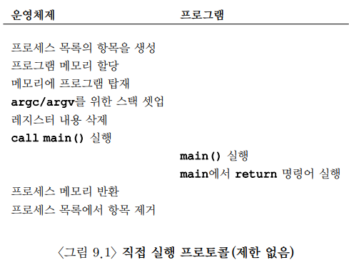
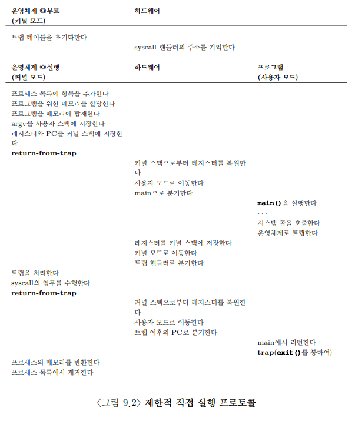
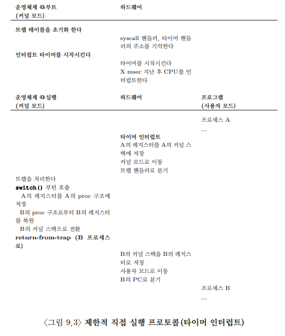

# [Mechanism: Limited Direct Execution](https://www.notion.so/Operating-Systems-9a584bef7b884f1ea3dcb7a3d83d4e80)

## 0. 개요

앞서 봤듯이 CPU 시간을 나누어 쓰는 방법으로 CPU를 가상화시킨다. 그러나 이는 몇 가지 문제를 가져온다.

- 시스템에 과중한 오버헤드를 주지 않으면서 구현할 수 있는가?
- CPU에 대한 통제를 유지하면서 프로세스를 효율적으로 실행시킬 수 있는가?

특히 두 번째 문제는 제어에 관한 문제로 이를 해결하지 못하면 하나의 프로세스가 컴퓨터를 장악하거나 접근 금지 구역을 접근할 수 있기 때문에 반드시 해결해야 할 문제이다.

## 1. 기본 원리: 제한적 직접 실행

이런 문제들을 해결하기 위해 나온 방법이 **제한적 직접 실행(Limited Direct Execution)** 이다. 

뒷 부분에 **직접 실행** 은 말그대로 프로그램을 CPU 상에서 직접 실행하는 것이다. 아무 제한이 없기 때문에 아래와 같이 직접 프로세스를 만들고 실행한다.

main() 으로 분기하고 커널로 되돌아 가기 위해 일반적인 호출과 리턴을 사용하였다. 

그러나 이 방식은 

- 운영체제가 원하지 않는 일을 할 수 있다.
- 프로세스 실행 시, 프로그램을 중단하고 다른 프로세스로 전환할 방법이 없다.

라는 문제가 있다. 즉, CPU 가상화를 위한 **시분할** 기법을 사용할 수 없다. 이에 대한 해결책을 탐구하면 '제한적' 이란 단어가 붙은 이유도 찾을 수 있을 것이다.

## 2. 문제점 1: 제한된 연산

직접 실행의 장점은 빠르게 실행된다는 것이다. 그러나 직접 실행을 허용하면 특수한 종류의 연산(디스크 입출력 요청, 자원 추가할당 요청 등)도 프로세스가 수행하게 해줘야하며 이는 접근 권한이 아무런 의미가 없어지게 한다.

이 때문에 **사용자 모드(user mode)** 와 **커널 모드(kernel mode)** 가 도입되었다. 

- 사용자 모드
	- 실행되는 코드 제한
- 커널 모드
	- 운영체제의 중요한 코드들이 실행
	- 모든 특수한 명령어를 포함하여 작업 가능

이때 사용자가 특수한 명령어를 사용해야 하는 경우가 있고 이를 위해 **시스템 콜** 을 제공한다. 시스템 콜을 이용해 다른 프로세스와의 통신, 메모리 할당 등의 일들을 사용자도 할 수 있게 된다.

시스템 콜을 사용하기 위해서 프로그램은 **trap** 특수 명령어를 실행해야 한다. 이 명령어는 커널 안으로 분기하는 동시에 커널 모드로 특권을 상향한다. 커널 모드에서 특수한 명령어를 수행하고 완료하면 운영체제는 **return-from-trap** 을 호출하여 모드를 다시 하향한다.

trap 명령어를 수행할 때는 사용자 모드에서 사용중인 레지스터들을 잘 저장했다가 return-from-step으로 다시 사용자 모드로 돌아올 때, 데이터를 복구해야 한다.

또한 trap이 운영체제 코드의 어디를 실행해야 하는지 알 수 있게 해야한다. 그러나 이는 신중하게 다뤄야 한다. 주소를 명시하는 것은 커널 내부를 접근할 수 있게 하는 위험한 일이기에 위험하다.

그렇기에 커널은 부팅 시에 **트랩 테이블(trap table)** 을 만들고 시스템을 통제한다. 운영체제는 특정 명령어를 사용하여 **트랩 핸들러(trap handler)** 의 위치를 알려주면 하드웨어는 이 정보를 전달받아 기억하고 있다가 사용한다. 

즉, 트랩 핸들러에게 특정 트랩 명령을 요청하면 트랩 핸들러가 트랩 테이블에 접근하여 트랩 명령을 수행하는 것이다. 

위 과정으로 트랩을 처리하게 된다. 이때 프로세스는 각자 커널 스택을 가지고 있는데 이는 커널 모드로 진입하거나 나올 때, 하드웨어에 의해 프로그램 카운터와 범용 레지스터들을 저장하고 복원하는 용도로 사용된다.

## 3. 문제점 2: 프로세스 간 전환

프로세스 간의 전환은 끊임없이 일어난다. 그렇다면 운영체제는 어떻게 CPU를 다시 획득하여 프로세스를 전환할 수 있는가?

### 협조 방식: 시스템 콜 기다리기

협조 방식은 프로세스가 합리적으로 실행할 것(운영체제를 위해 주기적으로 CPU를 포기할 것)이라 믿고 맡기는 방법이다. 이때 프로세스는 시스템 콜을 호출하여 CPU에게 제어권을 넘길 것이다. 혹은 비정상적인 행위를 할 때도 제어권이 넘어갈 것이다.

허나 악의적으로 CPU를 점거하거나 프로세스가 무한 루프에 빠져 나올 수 없는 등에 문제가 생길 수 있다.

### 비협조 방식: 운영체제가 전권을 행사

협조적인 방식에선 프로세스가 무한 루프에 빠졌을 때, 할 수 있는 것은 재부팅밖에 없다. 그래서 이를 해결하기 위해 수 밀리 초마다 인터럽트를 발생시키는 **타이머 인터럽트(timer interrupt)** 를 이용한다. 인터럽트가 발생하면 현재 수행 중인 프로세스는 중단되고 미리 구성된 운영체제의 **인터럽트 핸들러(interrupt handler)** 가 실행된다. 그렇게 CPU의 제어권을 가져온다.

### 문맥의 저장과 복원

프로세스의 우선순위는 **스케줄러(scheduler)** 가 정한다. 정책은 다음 챕터에 이야기할 것이며 전환이 결정되면 운영체제는 **문맥 교환(context switch)** 을 실행한다.

문맥 교환은 현재 실행 중인 프로세스의 레지스터 값을 커널 스택 같은 곳에 저장하고 곧 실행될 프로세스의 커널 스택의 레지스터를 복원하여 전환하는 것이다. 이렇게 함으로써 운영체제는 **return-from-trap** 명령어가 마지막으로 실행할 때, 현재 실행 중인 프로세스가 아니라 전환할 프로세스를 반환한다.

위 과정에선 레지스터의 저장과 복원이 각각 타이머 인터럽트와 프로세스 전환 과정에서 일어난다. 

## 4. 병행성

만약 타이머 인터럽트와 프로세스 간의 전환이 동시에 일어날 수 있다. 이는 병행성에서 자세히 다룰 것이지만 해법을 먼저 이야기하면 인터럽트를 불능화시키거나 접근을 방지하는 **lock** 을 이용한다.