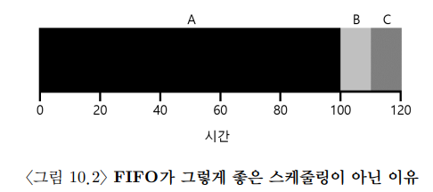
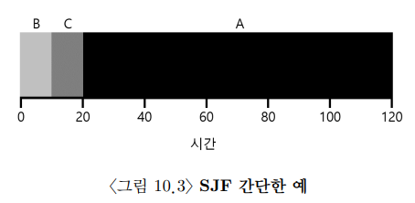
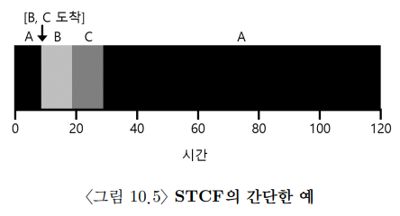
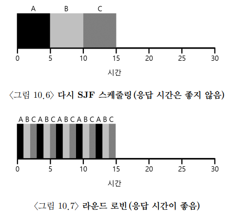
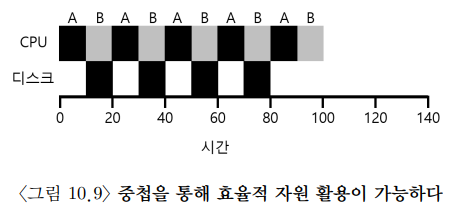

# [Scheduling: Introduction](https://pages.cs.wisc.edu/~remzi/OSTEP/Korean/07-cpu-sched.pdf)

## 1. 워크로드에 대한 가정

일련의 프로세스들이 실행하는 상황을 **워크로드(workload)** 라고 부르기도 한다. 앞으로 볼 작업에 대한 가정은 비현실적이나 우선은 다음과 같다.

- 모든 작업은 같은 시간 동안 실행
- 모든 작업은 동시에 도착
- 각 작업은 시작되면 완료될 때까지 실행
- 모든 작업은 CPU만 사용(입출력 X)
- 각 작업의 실행 시간은 사전 고지

## 2. 스케줄링 평가 항목

스케줄링 평가 항목은 스케줄링 정책을 비교하기 위해 필요하다. 크게 두 가지를 가지고 스케줄링을 평가한다.

1. **반환 시간(turnaround time)** 
		- 작업이 도착한 시간 ~ 작업이 완료된 시간
		- 성능 측면에서 평가
2. **공정성(fairness)**
		- 말 그대로 공정하고 배분되었는가

반환 시간과 공정성을 두 개다 가져가면 좋지만 대부분은 그렇게 되지 못한다.

## 3. 선입선출

가장 기초적인 방법으로 **FIFO** 가 있다. 이는 우리의 가정하에선 잘 작동한다.
허나 앞서 도착한 작업이 길면 평균 반환 시간이 많이 늘어난다. 

이러한 문제점을 **convoy effect** 라고 하며 짧은 작업들이 긴 작업을 기다리는 것을 의미한다.

## 4. 최단 작업 우선

convoy effect를 해결하기 위해 가장 짧은 작업부터 실행하는 것이 **최단 작업 우선(SJF)** 이다. 

모든 작업이 동시에 도착한다면 sjf가 최적의 스케줄링 알고리즘임을 알 수 있다. 

그러나 동시에 도착하다는 가정을 깨고 B와 C가 늦게 도착한다면 convoy effect는 다시 발생한다.

## 5. 최소 잔여시간 우선

이를 위해 프로세스 간의 전환을 사용하기 시작한다. B와 C가 도착한 시점에서 잔여시간이 A보다 짧기 때문에 A를 중단하고 B와 C를 먼저 실행하는 것이다. SJF는 비선점형 스케줄러이기에 할 수 없으나 **최단 잔여시간 우선(STCF)** 는 할 수 있다.

작업들이 동시에 도착할 경우, STCF는 최적의 스케줄링이다.

## 6. 새로운 평가 기준: 응답 시간

작업의 길이를 미리 알고, CPU만 사용하며, 평가 기준이 반환 시간 하나라면 STCF는 최적의 정책이다. 그러나 시분할 컴퓨터의 등장으로 **응답 시간(response time)** 이라는 평가가 생기며 변하게 된다.

응답 시간은 작업이 도착할 때 ~ 처음 작업이 시작 될 때까지 시간으로 정의한다.

이 기준으로 위의 평가들을 본다면 별로 좋지 않은 스케줄러임을 알 수 있다.

## 7. 라운드 로빈

이러한 응답 시간을 해결하기 위해 등장한 것이 라운드 로빈 방법이다. 라운드 로빈은 작업이 실행되는 일정 시간(**time slice** 또는 **scheduling quantum**) 동안 실행한 후 실행 큐의 다음 작업으로 전환한다. 이러한 동작때문에 RR은 떄로 **타임 슬라이싱** 이라고 불린다. 이때 타임 슬라이스의 길이는 타이머 인터럽트 주기의 배수여야 한다.

타임 슬라이스가 짧을수록 응답 시간 기준으로 스케줄링은 좋아지지만 문맥 교환 비용이 커지기에 그 사이에서 효율적인 타임 슬라이스를 잘 찾아야 한다.

만약 반환 시간만으로 스케줄링 정책을 평가한다면 rr이 최고임은 맞지만 이는 실제적으로 굉장히 비효율적이다. 이는 완료 시간만 고려하기 때문이다.

- 공정한 정책
	- RR과 같은 정책
	- 작은 시간 단위로 CPU를 분배
	- 반환 시간 기준 나쁨
- 불공정한 정책
	- SJF, STCF와 같은 정책
	- 응답 시간 기준 나쁨

## 8. 입출력 연산 고려

만약 가정에서 하나를 더 빼서 입출력 연산을 수행한다면 스케줄링 정책은 더욱 복잡해진다. 입출력 요청을 발생시키면 입출력 연산이 끝날 때까지 CPU를 사용하지 않기에 그 시간 동안 다른 스케줄을 실행하는 것이 합리적이다. 또한 입출력 완료 시에도 입출력이 끝난 프로세스를 바로 실행시킬지 아닐지도 결정해야 한다.

이를 위해 프로세스 연산을 중첩시킨다.

## 9. 그러나...

허나 우리의 가정에서 가장 치명적인 것이있다. 이는 작업의 실행 시간을 알고 있다는 가정이다. 우리는 이 길이에 대해서 알 수 없다. 그렇기에 가까운 과거를 이용하여 미래를 예측하는 스케줄러를 생각하게 된다.