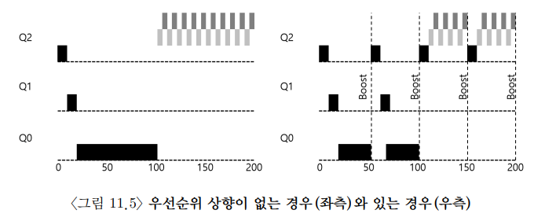
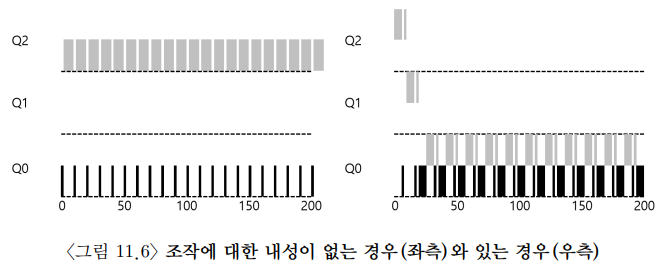

# [The Multi-Level Feedback Queue](https://pages.cs.wisc.edu/~remzi/OSTEP/Korean/08-cpu-sched-mlfq.pdf)

## 0. 개요

**Multi-level Feedback Queue(MLFQ)** 는 가장 유명한 스케줄링 기법이다. 

MLFQ는 앞선 스케줄링들의 두 가지 문제를 해결하려 한다.

1. 짧은 작업을 먼저 실행시켜 반환 시간을 최적화하고자 한다.
		- 이때 우리는 저번처럼 실행 시간을 미리 알수는 없다.
2. MLFQ는 대화형 사용자(화면 앞에서 프로세스의 종료를 기다리는 사용자)에게 응답이 빠른 시스템이라는 느낌을 주고 싶기에 응답 시간을 최적화하고자 한다.

## 1. 기본 규칙

MLFQ는 여러 개의 큐로 구성되며, 각각 다른 우선순위가 배정된다. ready 상태의 프로세스는 이 중 하나의 큐에 존재한다. MLFQ는 실행할 프로세스를 결정하기 위하여 우선순위를 사용한다. 

이때 우선순위는 동적으로 변한다. 어떤 작업이 오래 기다리면서 CPU를 계속 양보하면 우선순위를 높게 유지하는 식으로 말이다. 이를 바탕으로 두 가지의 기본 규칙이 주어진다.

- Priority(A) > Priority(B) 이면, A가 실행된다. (B는 실행되지 않는다.)
- Priority(A) = Priority(B) 이면, A와 B는 RR 방식으로 실행된다.

허나 우선순위가 높은 것이 두 개있고 낮은 것들이 있다면 작업 우선순위가 바뀌지 않아 아래의 것들은 실행되지 않을 것이다.

## 2. 시도 1: 우선순위의 변경

워크로드의 특성을 반영하여 짧은 실행 시간을 갖고 CPU를 자주 양보하는 대화형 작업과 많은 CPU 시간을 요구하지만 응답 시간은 중요하지 않은 긴 실행 시간의 CPU위주 작업이 혼재되어있다고 생각한다. 이를 위해 몇가지 규칙을 더 만들어보면 다음과 같다.

- 작업이 시스템에 진입하면, 가장 높은 우선순위, 즉 맨 위의 큐에 놓인다.
- 주어진 타임 슬라이스를 모두 사용하면 우선순위는 낮아진다. 한 단계 하락
- 타임 슬라이스를 소진하기 전에 CPU를 양도하면 우선순위를 유지한다.

위와 같은 규칙을 통해 실행 시간을 알 수 없어도 우선순위를 조절할 수 있다.

허나 MLFQ는 세 가지 문제를 가진다.

1. 기아 상태(starvation)
		- 너무 많은 대화형 작업이 존재하면 그 작업들에게 CPU를 모두 쓰게 된다.
		- 이러면 긴 실행 시간 작업은 CPU시간을 할당받지 못한다.

2. CPU를 거의 독점하는 상황
		- 스케줄러를 자신에게 유리하게 동작하는 프로그램을 만들 수 있다.
		- 이러면 CPU를 거의 독점하게 된다.

3. 프로그램은 시간 흐름에 따라 특성이 변할 수 있다.
		- CPU 위주 작업이 대화형 작업으로 바뀔 수 있다.
		- 이런 작업은 대화형 작업들과 같은 대우를 받을 수 없다.

## 3. 시도 2: 우선순위의 상향 조정

간단하게 생각할 수 있는 규칙은 다음과 같다.

- 일정 기간이 지나면, 시스템의 모든 작업을 최상위 큐로 이동

이 규칙은 starvation과 특성이 변하는 작업에 관한 문제를 해결할 수 있다. 물론 일정 기간을 정하는 것이 중요한데 이러한 종류의 값을 **부두 상수(voo-doo constants)** 라고 불렀다. 이 값을 정확하게 결정하기 위해서 부두술이 필요해 보였기 때문이다.

이 값이 너무 크면 긴 실행 시간을 가진 작업이 굶어 죽으며, 너무 작으면 대화형 작업이 적절한 양의 CPU 시간을 사용할 수 없게 된다.

## 4. 시도 3: 더 나은 시간 측정

그리고 악성 유저가 자신에게만 유리하게 작동하는 동작을 하지 못하도록 막아야 한다. 이를 위해 우리는 CPU 총 사용 시간을 측정하여 규칙을 수정할 것이다.

- 주어진 단계에서 시간 할당랼을 소진하면 (CPU의 양도 횟수와 관계없이) 우선순위를 낮춘다.

## 5. MLFQ 조정과 다른 쟁점들

그 외에도 다양한 쟁점들이 있다.

- 필요한 변수들을 스케줄러가 어떻게 설정할 것인가
- 몇 개의 큐가 존재해야 하는가
- 큐당 타임 슬라이스의 크기는 얼마로 해야하는가
- 얼마나 자주 우선순위가 조정되어야 하는가

이러한 쟁점은 확연한 답이 존재하지 않으며 워크로드에 대해 경험하고 조정하며 균형점을 찾아가야 한다.

## 6. 요약

위에서 찾고 만든 MLFQ의 규칙을 정리하면 다음과 같다.

1. 우선순위(A) > 우선순위(B) 일 경우, A가 실행되고 B는 실행되지 않는다.
2. 우선순위(A) = 우선순위(B) 일 경우, A와 B는 RR 방식으로 실행된다.
3. 작업이 시스템에 들어가면 최상위 큐에 배치된다.
4. 작업이 지정된 단계에서 CPU 양도 횟수와 관계 없이 배정받은 시간을 소진하면 작업의 우선순위는 감소한다.
5. 일정 주기 S가 지난 후, 시스템의 모든 작업을 최상위 큐로 이동시킨다.