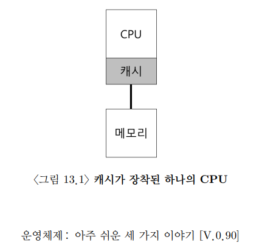
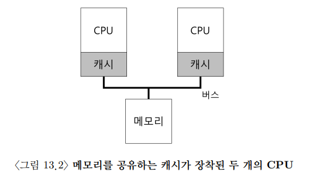
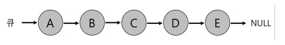
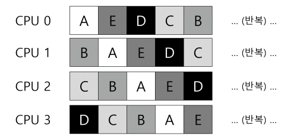
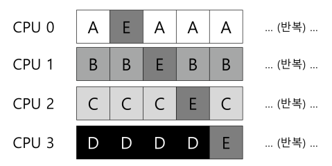
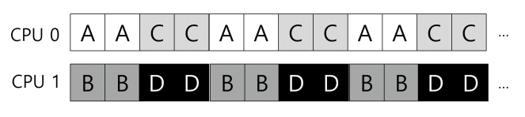
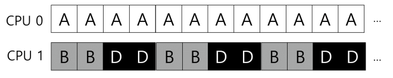
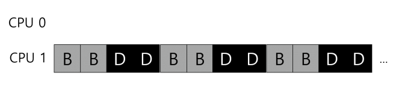
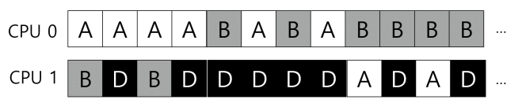

# [Multiprocessor Scheduling](https://pages.cs.wisc.edu/~remzi/OSTEP/Korean/10-cpu-sched-multi.pdf)

## 0. 개요

멀티코어의 시대가 오면서 다수의 CPU를 사용할 수 있게 되었다. 그러나 이것이 더 빠른 작업을 보장하진 않는다. 이를 보장해주기 위해 **병렬(parallel)** 로 실행되도록 다시 작성을 해야한다. 그리고 보통 **스레드** 를 사용한다.

이 외에도 여러 CPU에게 할당해줄 멀티프로세서 스케줄러가 필요하다. 이제 단일 프로세서 스케줄링의 많은 원칙들을 멀티프로세서로 확장하는 논의가 필요하다.

## 1. 배경: 멀티프로세서 구조

먼저 단일 CPU와 멀티 CPU의 차이를 알아야 한다. 

단일 CPU는 하드웨어 캐시 계층이 존재한다. 이 캐시는 프로그램을 빠르게 실행하기 위해 존재한다.

> 캐시는 메인 메모리에서 자주 사용되는 데이터의 복사본을 저장하는 작고 빠른 메모리이다. 메인 메모리는 모든 데이터를 저장하지만 느리기에 자주 접근되는 데이터를 캐시에 임시로 가져다 둠으로써 크고 느린 메모리를 빠른 메모리처럼 보이게 한다.

프로그램이 처음 실행될 때는 메모리에서 데이터를 가져오지만 다시 사용될 것으로 예상되는 데이터는 그 복사본을 CPU 캐시에 저장한다. 그리고 프로그램이 다시 실행되려 할 때, 먼저 캐시를 확인하고 진행한다. 

캐시는 **지역성(locality)** 에 기반한다.

- **시간 지역성(temporal locality)**
	- 데이터가 한 번 접근되면 가까운 미래에 다시 접근될 가능성이 높다는 것
	- 예를 들어 루프에서 여러번 반복해서 접근하는 변수나 명령어
- **공간 지역성(spatial locality)**
	- 접근한 데이터의 주변 데이터에 접근할 확률이 높다는 것

허나 멀티 CPU는 캐시는 각자 가지고 있지만 메모리는 공유하고 있다. 여기서 문제가 발생한다.

만약 CPU1에서 실행 중인 프로그램이 주소 A를 가져온다면 메모리에서 가져와서 작업을 하고 (메모리에 작업하는 것이 오래 걸리기에) 우선 캐시에만 저장한다. 그리고 작업을 잠시 중단하고 CPU2로 이동하여 주소 A를 다시 읽게 된다면 변경되지 않은 주소를 가져오게 된다.

이렇게 각 cpu에서 데이터들이 일관적이지 않은 **캐시 일관성 문제(cache coherence)** 가 생긴다. 이에 대한 해결책은 다른 책을 참고해야 한다.

물론 하드웨어 측면에서 기본적인 해결책을 제공하는데 하드웨어가 메모리를 계속해서 감시하여 항상 제대로된 상황만 발생하도록 만든다거나 여러 개의 프로세스들이 하나의 메모리에 갱신할 때는 항상 공유되도록 한다거나 하는 것이다. 자신의 복사본을 무효화하거나 갱신시키는 방법도 존재한다.

## 2. 동기화 문제

동기화 문제는 이곳에서도 발생할 수 있다. 이에 대해선 나중에 다시 살펴볼 것

## 3. 마지막 문제점: 캐시 친화성

프로세스가 CPU에서 실행될 때, 프로세스는 해당 CPU 캐시와 TLB(추후에 나옴)에 상당한 양의 상태 정보를 올려 놓게 된다. 이는 다음 번에 프로세스가 실행될 때, 동일한 CPU에서 실행된다면 매우 유리하게 작업을 진행할 수 있다. 

허나 다른 CPU에서 실행하게 된다면 실행할 때마다 필요한 정보를 다시 캐시에 탑재해야해서 프로세스의 성능은 단일보다 더 나빠진다. 

이러한 문제를 **캐시 친화성(cache affinity)** 라고 하는데 멀티프로세서 스케줄러는 이 문제 역시 중요하게 고려해야 한다.

## 4. 단일 큐 스케줄링

멀티프로세서 시스템의 스케줄러를 개발하는 간단한 방법은 단일 프로세서의 스케줄링을 그대로 사용하는 것이다. 이 방식을 **단일 큐 멀티프로세서 스케줄링(single queue multiprocessor scheduling, SQMS)** 이라고 한다. 이 방식은 단순하다는 장점이 있다. CPU가 2개라면 실행할 작업을 두 개 선택하면 된다.

그러나 SQMS는 명확한 단점이 있는데 첫번째는 **확장성(scalability)** 결여이다. 스케줄러가 다수의 CPU에서 제대로 동작하기 위해선 코드에 일정 형태의 **락(lock)** 을 삽입해야 한다. 그래야만 올바른 결과를 얻을 수 있다. 허나 락은 성능을 크게 저하시킬 수 있으며 CPU 개수가 증가할수록 심해진다.  락에 사용하는 시간이 더 커지고 작업에 사용하는 시간이 작아지는 것이다. 

두번째 문제는 캐시 친화성이다. 이는 같은 CPU에 할당하지 못하는 상황이 많이 생김을 아래의 그림으로 알 수 있다. 

그렇기에 아래처럼 대부분의 작업이 동일 CPU에서 진행되도록 하는 기법을 적용한다. 

허나 이 기법은 구현이 너무 복잡해진다.

## 5. 멀티 큐 스케줄링

**multi-queue multiprocessor scheduling(MQMS)** 는 CPU마다 큐를 두는 방식이다. 각 큐는 특정 스케줄링 규칙을 따를 것이고 작업은 여러 큐 중 하나에 배치받는다. 배치 방법은 무작위나 작업 수를 비교해 적당히 배치한다. 그 후, 독립적으로 시행되기에 정보의 공유와 동기화 문제를 피할 수 있다. 

그렇기에 MQMS가 SQMS에 비해 가지는 명확한 이점은 확장성이 좋다는 것이다. CPU의 개수가 증가할수록, 큐의 개수도 증가하므로 락과 캐시 경합이 문제가 되지 않는다. 또한 MQMS는 본질적으로 캐시 친화적이다. 

그러나 멀티 큐의 근본적 문제는 **워크로드의 불균형(load imbalance)** 이다. 아래와 같은 상황이 생기기 쉽다.

이와 같은 문제를 해결하기 위해 우리는 작업을 이동시키는 것 말고 다른 방법을 찾을 수는 없다. 이를 **이주(migration)** 이라고 한다. 위에서 두번째 사진은 CPU 0이 쉬고 있으므로 B나 D를 보내 균형을 맞출 수 있다. 

그러나 만약 위에서 첫번째 사진처럼 불균형한 상태라면 우리는 작업을 적당히 이동시키며 일정한 타임 슬라이스동안 혼자 실행되고 이주하도록 만들어야 한다. 

이러한 기법을 **작업 훔치기(work stealing)** 이라고 한다.  작업 훔치기에선 작업의 개수가 낮은 큐가 가끔씩 다른 큐의 개수를 확인하여 차이가 크다면 하나 이상의 작업을 가져오는 작업을 말한다. 

이때 큐 검사의 빈도가 올라가면 오버헤드가 커지기에 적절한 값을 찾는 것이 관건이다.