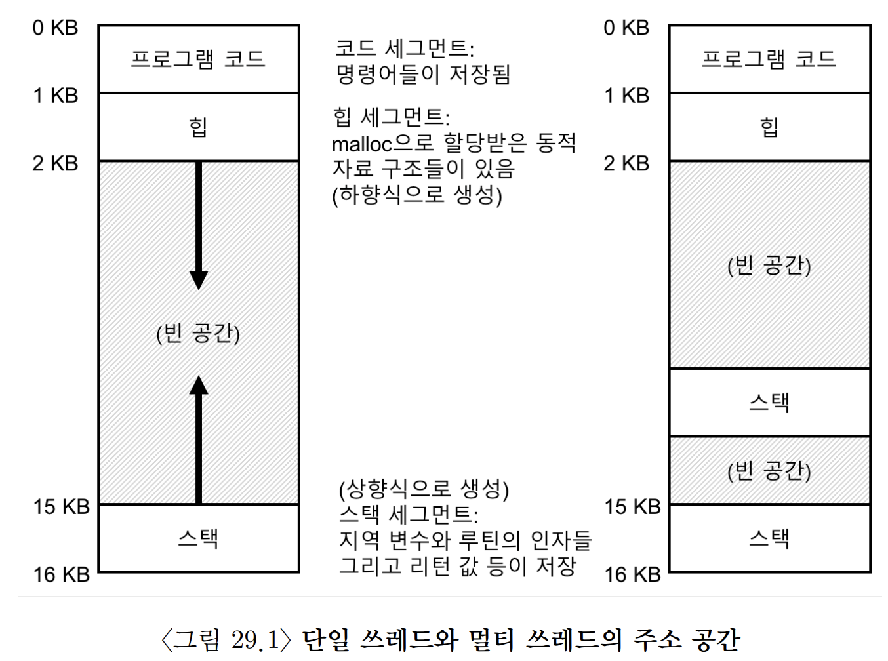

# [Introduction](https://pages.cs.wisc.edu/~remzi/OSTEP/Korean/26_threads-intro.pdf)

## **쓰레드(thread)**

- 하나 이상의 실행 지점(독립적으로 불러 들여지고 실행될 수 있는 여러 개의 PC 값)을 가지고 있다.
- 프로세스와 공통점
	- 쓰레드는 프로세스와 거의 유사하게 반드시 **문맥 교환** 을 통해서 실행 중인 쓰레드와 교체된다.
	- 또한 PCB처럼 쓰레드 제어 블럭(thread control block, TCB)이 필요하다.
- 프로세스와 차이점
	- 쓰레드들은 주소 공간을 공유하기 때문에 동일한 값에 접근할 수 있다.
	- 쓰레드 간의 문맥 교환에선 주소 공간을 그대로 사용한다.
		- 즉, 사용하고 있던 페이지 테이블을 그대로 사용한다.
	- 고전적인 단일 쓰레드 프로세스는 스택이 하나만 존재한다.
	- 허나 멀티 쓰레드 프로세스는 각 쓰레드가 독립적으로 실행되며 이를 위해 여러 루틴을 호출할 수 있다.
	- 주소 공간에는 쓰레드마다 스택이 할당되어 있다.
	- 스택에서 할당되는 변수, 매개변수, 리턴값 등의 스택에 저장되는 값들은 쓰레드의 스택인 쓰레드-로컬 저장소(thread-local storage)에 저장된다.
		- 이는 예전처럼 주소 공간의 확장이 자유롭지 않음을 의미한다.
		- 그러나 다행히 스택의 크기가 아주 크지 않아도 되기에 대부분의 경우는 문제가 되지 않는다.
		- 재귀 호출이 많을 때는 예외로 문제가 된다.

## 쓰레드의 실행

- 쓰레드는 스케줄러에 따라 실행 순서가 결정되기에 생성 시기와 관계 없이 호출될 때마다 다양한 순서로 실행된다.
- 그렇기에 실행되는 순서는 다양한 경우의 수가 생긴다.

## 데이터의 공유

- 데이터를 공유하게 되며 동시에 데이터에 접근했을 때, 우리가 원하는 값을 가져올 수 없다.

## 제어 없는 스케줄링

- 데이터 공유가 문제가 되는 이유는 하나의 쓰레드가 값을 변화시키고 자신의 레지스터에 저장을 한 뒤, 문맥 교환으로 다른 쓰레드로 변형되어 공유된 값을 건드릴 때 발생한다.
- 즉, 자신 만의 쓰레드에 저장만 한채로 문맥 교환이 일어나 제대로 변환되지 못하는 것이다.
- 이처럼 실행 순서에 따라 결과가 달라지는 상황을 **경쟁 조건(race condition)** 이라고 부른다.
	- 문맥 교환에 따라 운이 없다면 계속해서 다른 결과를 얻게 된다.
- 이는 일반적으로 발생하는 **결정적** 결과와 달리 결과가 어떠할지 알지 못하거나 실행할 때마다 결과가 다른 경우로 **비결정적(indeterminate)** 인 결과라고 부른다.
- 이러한 공유되는 영역을 **임계 영역(critical section)** 이라고 부른다.
- **상호 배제(mutual exclusion)** 는 이러한 문제를 해결하기 위해 나온 방법 중 하나이다.

## 원자성에 대한 바람

- 예를 들어 메모리에 어떤 값을 더하는 명령어를 하드웨어가 원자성을 보장한다고 하자.
- 그렇다면 명령어 수행 도중에 인터럽트가 발생하지 않을 것이고 발생하더라도 명령어의 중간 상태에 있지 못한다.
- 원자성을 위해선 하드웨어적으론 **동기화 함수(synchronization primitives)** 구현에 필요한 기본적인 명령어 몇 개만 필요하다.
- 결과적으로 병행 실행이라는 상황에서도 하드웨어 동기화 명령어와 운영체제의 지원을 통해 한 번에 하나의 쓰레드만 임계 영역에 접근하도록 만들어야 한다.

## 상대 기다리기

- 하나의 쓰레드가 다른 쓰레드의 동작이 종료될 때까지 기다려야 하는 상황이 발생할 수도 있다.

